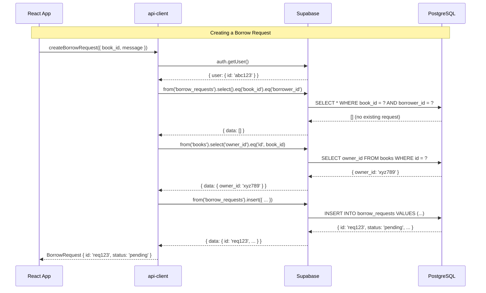
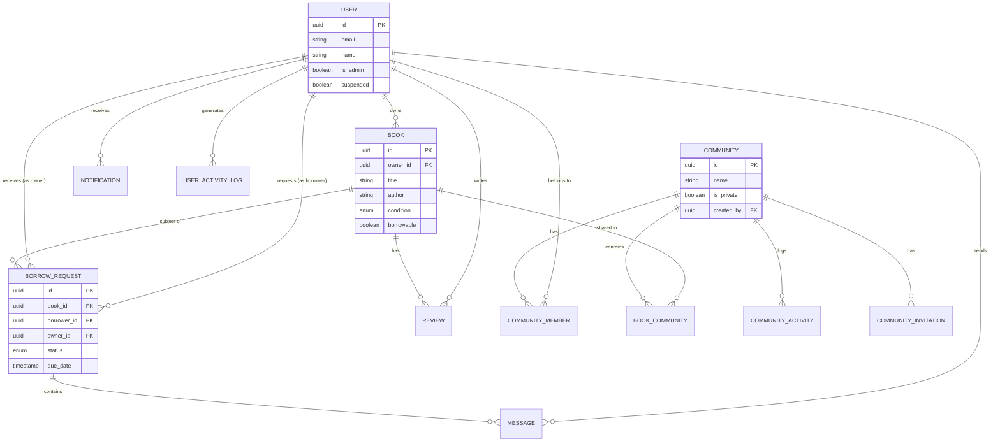
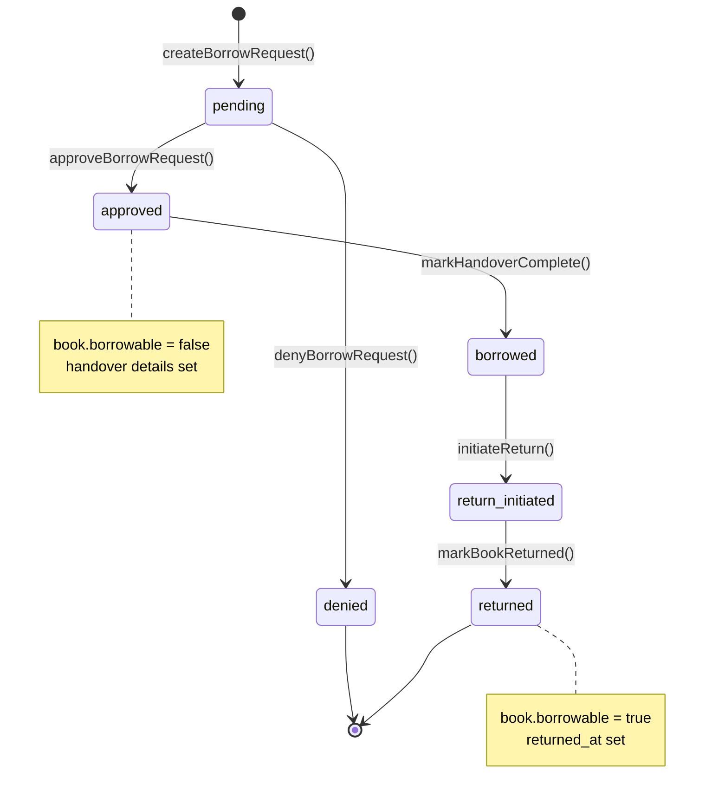
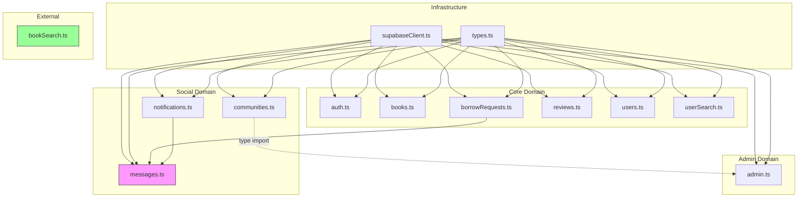

# Day 7: Final Consolidation & Mental Model

## Learning Objectives

By the end of today, you will:
- Have a complete mental model of the api-client
- Understand architecture through visual diagrams
- Have a best-practice checklist for backend clients
- Know what to say about this in interviews
- Have a roadmap for continued learning

---

## 1. The Big Picture: 7 Days Summarized

### Day 1: Architecture Foundation
- The api-client is a **backend abstraction layer**
- 13 files organized into Infrastructure, Domain, and External layers
- Design principles: single responsibility, abstraction boundaries, throw on error

### Day 2: Data Modeling
- 9 main entities with intentional denormalization
- BorrowRequest is a state machine with 6 states
- JSONB for flexible payloads, UUIDs for IDs

### Day 3: Query Patterns
- PostgREST filter syntax via Supabase client
- Embedded resources for joins
- Performance issues: N+1 queries, unindexed text search

### Day 4: Module Architecture
- Most modules are cleanly isolated
- `messages.ts` is the most coupled (2 dependencies)
- `admin.ts` is a "god module" that needs splitting

### Day 5: Security & Reliability
- RLS is the foundation of data security
- Non-atomic operations risk inconsistent state
- Suspended users can still sign in (bug!)

### Day 6: Refactoring Path
- Split large modules by domain concern
- Event-based architecture for cross-cutting concerns
- Database transactions via RPC for atomicity

---

## 2. The Complete Mental Model

### Layer Diagram

```
┌─────────────────────────────────────────────────────────────────────────────┐
│                              CONSUMER LAYER                                  │
│                     (apps/web components and hooks)                         │
│                                                                              │
│   import { getBooks, createBorrowRequest } from '@repo/api-client';         │
└──────────────────────────────────┬──────────────────────────────────────────┘
                                   │
                                   ▼
┌─────────────────────────────────────────────────────────────────────────────┐
│                           API CLIENT PACKAGE                                 │
│                         (@repo/api-client)                                  │
├─────────────────────────────────────────────────────────────────────────────┤
│                                                                              │
│  ┌────────────────────────────────────────────────────────────────────────┐ │
│  │                         PUBLIC API (index.ts)                          │ │
│  │   Exports: Functions + Types | Does NOT export: supabase client        │ │
│  └────────────────────────────────────────────────────────────────────────┘ │
│                                   │                                          │
│           ┌───────────────────────┼───────────────────────┐                 │
│           ▼                       ▼                       ▼                 │
│  ┌─────────────────┐   ┌─────────────────┐   ┌─────────────────┐           │
│  │   CORE DOMAIN   │   │ SOCIAL DOMAIN   │   │  ADMIN DOMAIN   │           │
│  │                 │   │                 │   │                 │           │
│  │ • auth.ts       │   │ • messages.ts   │   │ • admin.ts      │           │
│  │ • books.ts      │   │ • notifications │   │   (stats,       │           │
│  │ • borrowReqs.ts │   │ • communities   │   │    moderation,  │           │
│  │ • reviews.ts    │   │                 │   │    analytics)   │           │
│  │ • users.ts      │   │                 │   │                 │           │
│  └────────┬────────┘   └────────┬────────┘   └────────┬────────┘           │
│           │                     │                     │                     │
│           └─────────────────────┼─────────────────────┘                     │
│                                 ▼                                           │
│  ┌────────────────────────────────────────────────────────────────────────┐ │
│  │                     INFRASTRUCTURE (supabaseClient.ts)                 │ │
│  │         Single Supabase client instance | Auth + DB + Storage          │ │
│  └────────────────────────────────────────────────────────────────────────┘ │
│                                                                              │
│  ┌────────────────────────────────────────────────────────────────────────┐ │
│  │                        TYPES (types.ts)                                │ │
│  │   User | Book | BorrowRequest | Review | Notification | Message | ...  │ │
│  └────────────────────────────────────────────────────────────────────────┘ │
│                                                                              │
├──────────────────────────────────┬──────────────────────────────────────────┤
│  EXTERNAL                        │  bookSearch.ts (Google Books API)        │
│  (No Supabase)                   │  Pure HTTP fetch, maps to BookSearchResult│
└──────────────────────────────────┴──────────────────────────────────────────┘
                                   │
                                   ▼
┌─────────────────────────────────────────────────────────────────────────────┐
│                              SUPABASE                                        │
│  ┌──────────────┐  ┌──────────────┐  ┌──────────────┐  ┌──────────────┐    │
│  │  PostgreSQL  │  │     Auth     │  │   Storage    │  │   Realtime   │    │
│  │   (tables,   │  │  (sessions,  │  │  (avatars,   │  │ (websocket   │    │
│  │    RLS,      │  │   JWT, RLS)  │  │   covers)    │  │  subscriptions)│   │
│  │   triggers)  │  │              │  │              │  │              │    │
│  └──────────────┘  └──────────────┘  └──────────────┘  └──────────────┘    │
└─────────────────────────────────────────────────────────────────────────────┘
```

---

### Data Flow Diagram



---

### Entity Relationship Diagram



---

### State Machine: Borrow Request



---

### Module Dependency Graph



---

## 3. Best Practice Checklist

### Architecture

- [ ] **Single export point** - All public API through `index.ts`
- [ ] **Backend abstraction** - Apps never import database client directly
- [ ] **Type separation** - Entity types in `types.ts`, input types co-located or centralized
- [ ] **Domain boundaries** - One file/folder per domain
- [ ] **No circular dependencies** - Use events for cross-cutting concerns

### Error Handling

- [ ] **Consistent pattern** - `if (error) throw error` or custom error types
- [ ] **Distinguish error types** - Not found vs unauthorized vs server error
- [ ] **Graceful degradation** - Secondary operations (notifications) don't fail primary
- [ ] **Meaningful messages** - Wrap database errors with context

### Security

- [ ] **RLS on all tables** - Never trust client-side auth checks alone
- [ ] **SECURITY DEFINER for cross-user ops** - Notifications, admin actions
- [ ] **Never expose service key** - Only anon key in client
- [ ] **Validate inputs** - Zod or similar runtime validation

### Performance

- [ ] **Avoid N+1 queries** - Use SQL aggregation or batch queries
- [ ] **Index based on query patterns** - Analyze `WHERE` and `ORDER BY` clauses
- [ ] **Paginate all list endpoints** - Never return unbounded results
- [ ] **Use full-text search** - Not `ILIKE '%term%'`
- [ ] **Cache stable data** - Genre distributions, admin stats

### Data Integrity

- [ ] **Transactions for multi-table ops** - RPC functions in PostgreSQL
- [ ] **Database constraints** - Unique indexes, foreign keys, check constraints
- [ ] **Triggers for denormalized data** - `last_message_at`, `borrowable` flags

### Testing

- [ ] **Mock the database client** - Factory pattern enables this
- [ ] **Test error paths** - Not found, unauthorized, validation failures
- [ ] **Integration tests for workflows** - Borrow request lifecycle

---

## 4. Interview Talking Points

When discussing this project in interviews:

### On Architecture

> "I built a backend abstraction layer that isolates Supabase-specific code from the React app. This means we can migrate to a custom NestJS backend without changing any frontend code. All database operations go through typed functions like `createBorrowRequest()` rather than raw Supabase calls."

### On Data Modeling

> "The borrow request is modeled as a state machine with six states: pending, approved, borrowed, return_initiated, returned, and denied. I intentionally denormalized `owner_id` onto the request for faster queries, and `borrowable` on books for availability checks without joins."

### On Security

> "I use Supabase's Row Level Security to enforce data access at the database level. For cross-user operations like creating notifications, I use SECURITY DEFINER functions that bypass RLS in a controlled way."

### On Trade-offs

> "I made a conscious choice to keep `borrowable` as a denormalized field updated in application code. The alternative was computing it from borrow requests, but that would require a join on every book listing. The trade-off is ensuring we update it atomically when approving or returning books."

### On Refactoring

> "The admin module grew to 1500+ lines. In hindsight, I should have split it earlier by domain: user management, content moderation, analytics. I've documented a refactoring plan that would take about 2 weeks to implement."

---

## 5. What You Now Understand

After these 7 days, you can:

1. **Explain the architecture** - Why abstraction layers matter
2. **Design data models** - Normalization trade-offs, state machines
3. **Write efficient queries** - Joins, aggregations, full-text search
4. **Structure code** - Single responsibility, dependency management
5. **Secure your app** - RLS policies, auth flows, input validation
6. **Plan refactoring** - Incremental improvement, testing strategies
7. **Discuss trade-offs** - Performance vs consistency, simplicity vs flexibility

---

## 6. Continued Learning Path

### Next Steps

1. **Add Tests** (1-2 weeks)
   - Unit tests for pure functions
   - Integration tests with Supabase local
   - E2E tests for critical flows

2. **Implement Refactoring Plan** (2-3 weeks)
   - Split large modules
   - Add RPC functions for transactions
   - Improve error types

3. **Performance Optimization** (1 week)
   - Add missing indexes
   - Implement full-text search
   - Add caching layer

### Resources

**Supabase**:
- [Supabase Docs](https://supabase.com/docs)
- [Supabase YouTube](https://www.youtube.com/@supabase)

**PostgreSQL**:
- [PostgreSQL Tutorial](https://www.postgresqltutorial.com/)
- [Use The Index, Luke](https://use-the-index-luke.com/)

**Architecture**:
- [Patterns of Enterprise Application Architecture](https://martinfowler.com/books/eaa.html)
- [Clean Architecture by Uncle Bob](https://blog.cleancoder.com/uncle-bob/2012/08/13/the-clean-architecture.html)

**TypeScript**:
- [Total TypeScript](https://www.totaltypescript.com/)
- [TypeScript Handbook](https://www.typescriptlang.org/docs/handbook/)

---

## 7. Final Architecture Vision

After all refactoring, the ideal structure:

```
packages/api-client/
├── src/
│   ├── index.ts                 # Public API barrel export
│   ├── types.ts                 # All entity + input types
│   ├── validations.ts           # Zod schemas
│   ├── errors.ts                # Custom error classes
│   ├── events.ts                # Event emitter for decoupling
│   │
│   ├── infrastructure/
│   │   ├── supabase.ts          # Client factory
│   │   ├── storage.ts           # File uploads
│   │   ├── cache.ts             # In-memory caching
│   │   └── repository.ts        # Base repository class
│   │
│   ├── auth/
│   │   └── index.ts             # Auth operations
│   │
│   ├── books/
│   │   ├── index.ts
│   │   ├── queries.ts
│   │   └── mutations.ts
│   │
│   ├── borrowRequests/
│   │   ├── index.ts
│   │   ├── types.ts
│   │   ├── queries.ts
│   │   ├── mutations.ts
│   │   ├── workflow.ts          # State transitions
│   │   └── tracking.ts          # Handover/return
│   │
│   ├── messages/
│   │   └── index.ts
│   │
│   ├── notifications/
│   │   └── index.ts
│   │
│   ├── reviews/
│   │   └── index.ts
│   │
│   ├── users/
│   │   ├── index.ts
│   │   └── search.ts
│   │
│   ├── communities/
│   │   ├── index.ts
│   │   ├── members.ts
│   │   ├── books.ts
│   │   ├── activity.ts
│   │   └── invitations.ts
│   │
│   ├── admin/
│   │   ├── index.ts
│   │   ├── stats.ts
│   │   ├── users.ts
│   │   ├── content.ts
│   │   ├── requests.ts
│   │   ├── notifications.ts
│   │   ├── analytics.ts
│   │   └── communities.ts
│   │
│   └── external/
│       └── bookSearch.ts        # Google Books API
│
├── tests/
│   ├── unit/
│   └── integration/
│
└── package.json
```

---

## 8. Closing Thoughts

You started this week unsure about your codebase. Now you understand:

- **Why** each design decision was made
- **What** trade-offs exist
- **How** to improve it
- **When** to refactor vs leave alone

This knowledge transforms a "vibe coded" project into a **deliberate engineering artifact** you can confidently discuss in interviews.

The api-client is already better than many production codebases. With the improvements identified this week, it would be exceptional.

**Your codebase is resume-ready. You just needed to understand it.**

---

## 9. Summary Card

Keep this for quick reference:

```
┌────────────────────────────────────────────────────────────────────┐
│                    BOOKSHARE API-CLIENT                            │
├────────────────────────────────────────────────────────────────────┤
│ PURPOSE:   Backend abstraction for Supabase                        │
│ PATTERN:   Repository-like modules with typed inputs/outputs       │
│ SECURITY:  RLS + SECURITY DEFINER functions                        │
│ REALTIME:  postgres_changes subscriptions                          │
├────────────────────────────────────────────────────────────────────┤
│ MODULES:   auth | books | borrowRequests | reviews | users         │
│            notifications | messages | communities | admin          │
│ EXTERNAL:  bookSearch (Google Books API)                           │
├────────────────────────────────────────────────────────────────────┤
│ STRENGTHS: Clean abstraction, typed API, migration-ready           │
│ WEAKNESSES: Large files, N+1 queries, non-atomic ops               │
├────────────────────────────────────────────────────────────────────┤
│ KEY INSIGHT: borrowable is denormalized for performance            │
│              BorrowRequest is a 6-state state machine              │
│              Cross-user ops use SECURITY DEFINER                   │
└────────────────────────────────────────────────────────────────────┘
```

---

**Congratulations on completing the 7-day curriculum!**

You now understand your api-client deeply. Go build something great with it.
