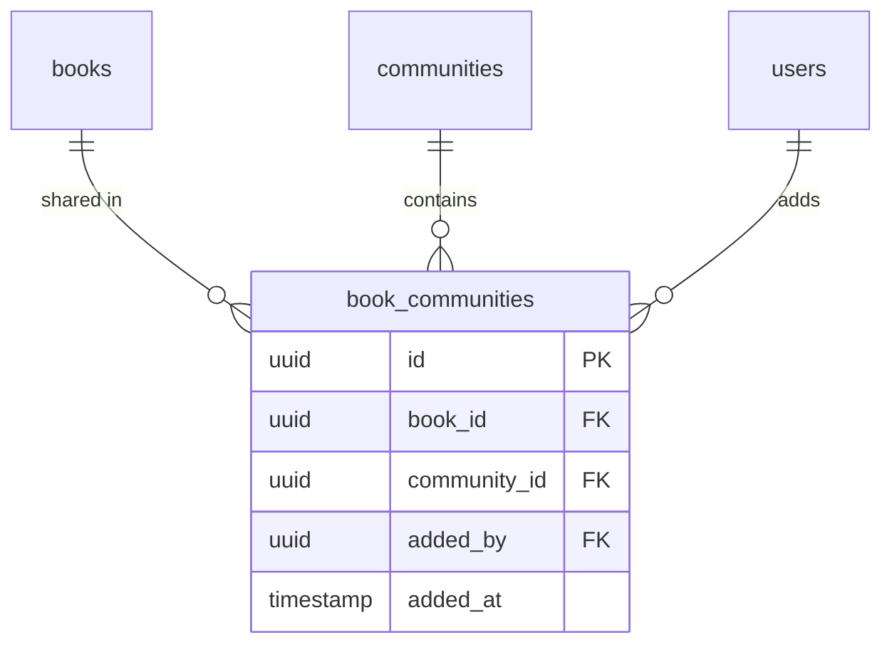

# book_communities

## 1. What This Table Models

The `book_communities` table is a **junction table** representing the many-to-many relationship between books and communities. It tracks which books are shared in which communities.

**Entity Type**: Junction/Relationship Entity

This table exists because:
- A book can be shared in multiple communities
- A community can contain multiple books
- Only book owners can share their books
- Tracks who added the book and when

---

## 2. Column-by-Column Deep Dive

### `id` (UUID, PRIMARY KEY)
- **Meaning**: Unique identifier for the book-community relationship
- **Default**: `uuid_generate_v4()`

### `book_id` (UUID, NOT NULL, FK)
- **Meaning**: The book being shared
- **Cascade**: ON DELETE CASCADE
- **Note**: If book deleted, sharing removed

### `community_id` (UUID, NOT NULL, FK)
- **Meaning**: The community the book is shared in
- **Cascade**: ON DELETE CASCADE
- **Note**: If community deleted, sharing removed

### `added_by` (UUID, NOT NULL, FK)
- **Meaning**: User who added the book to the community
- **Cascade**: ON DELETE CASCADE
- **Constraint**: Should be the book owner (enforced via RLS)

### `added_at` (TIMESTAMPTZ, NOT NULL, DEFAULT NOW())
- **Meaning**: When the book was added to the community

---

## 3. Constraints & Indexes

### Primary Key
```sql
PRIMARY KEY (id)
```

### Foreign Keys
```sql
REFERENCES public.books(id) ON DELETE CASCADE
REFERENCES public.communities(id) ON DELETE CASCADE
REFERENCES public.users(id) ON DELETE CASCADE
```

### Unique Constraint
```sql
UNIQUE(book_id, community_id)
```
- **Critical**: A book can only be added once to each community
- Prevents duplicate entries

### Indexes
```sql
CREATE INDEX book_communities_book_id_idx ON public.book_communities(book_id);
CREATE INDEX book_communities_community_id_idx ON public.book_communities(community_id);
```

### Triggers
```sql
-- Track book added to community
CREATE TRIGGER create_book_added_activity_trigger AFTER INSERT ON public.book_communities
  FOR EACH ROW EXECUTE FUNCTION create_book_added_activity();

-- Track book removed from community
CREATE TRIGGER track_book_removed_trigger BEFORE DELETE ON public.book_communities
  FOR EACH ROW EXECUTE FUNCTION track_book_removed();
```

---

## 4. Relationships to Other Tables



### Relationships

| Related Table | Relationship | Notes |
|---------------|--------------|-------|
| `books` | many:1 | The book being shared |
| `communities` | many:1 | Target community |
| `users` | many:1 | Who added it |

---

## 5. RLS (Row-Level Security) Rules

RLS is **ENABLED** on this table.

### Policies

| Policy | Operation | Rule |
|--------|-----------|------|
| "Members can view books in their communities" | SELECT | Member OR public community |
| "Book owners can add books to their communities" | INSERT | Owner of book AND member of community |
| "Owners and admins can remove books from communities" | DELETE | Book owner OR community admin |

### INSERT Policy Detail

```sql
CREATE POLICY "Book owners can add books to their communities"
  ON public.book_communities FOR INSERT
  WITH CHECK (
    auth.uid() = added_by
    AND EXISTS (
      SELECT 1 FROM public.books b
      WHERE b.id = book_id
      AND b.owner_id = auth.uid()  -- Must own the book
    )
    AND is_community_member(community_id, auth.uid())  -- Must be member
  );
```

### Key Enforcement

- **Only book owners** can share their books
- **Must be community member** to share
- **Book owner OR community admin** can remove

👉 [Supabase Row Level Security](https://supabase.com/docs/guides/auth/row-level-security)

---

## 6. How This Table Is Used in the api-client

### Query Locations

```typescript
// communities.ts
.from('book_communities')
.insert({ book_id, community_id, added_by: user.id })          // addBookToCommunity

.from('book_communities')
.delete()
.eq('book_id', bookId)
.eq('community_id', communityId)                                // removeBookFromCommunity

.from('book_communities')
.select(`
  *,
  book:books!book_id (
    *, owner:users!owner_id (id, name, avatar_url)
  )
`)
.eq('community_id', communityId)                                // getCommunityBooks

.from('book_communities')
.select(`*, community:communities!community_id (id, name)`)
.eq('book_id', bookId)                                          // getBookCommunities
```

### Query Analysis

| Query | Optimal? | Notes |
|-------|----------|-------|
| Get community books | Yes | Index on community_id |
| Get book's communities | Yes | Index on book_id |
| Add book | Yes | Simple insert |
| Remove book | Yes | Uses unique constraint |

---

## 7. Alternative Schema Designs

### Alternative A: Composite Primary Key

```sql
CREATE TABLE book_communities (
  book_id UUID REFERENCES books(id),
  community_id UUID REFERENCES communities(id),
  added_by UUID REFERENCES users(id),
  added_at TIMESTAMPTZ DEFAULT NOW(),
  PRIMARY KEY (book_id, community_id)
);
```

**Pros**: No separate id, natural key
**Cons**: Some frameworks prefer single id

### Alternative B: Share to Multiple Communities at Once

```sql
-- Batch insert function
CREATE FUNCTION share_book_to_communities(
  p_book_id UUID,
  p_community_ids UUID[]
) RETURNS SETOF book_communities;
```

**Pros**: Efficient bulk sharing
**Cons**: Current API supports this via multiple calls

### Alternative C: Track Borrowing from Community

```sql
ALTER TABLE borrow_requests ADD COLUMN source_community_id UUID REFERENCES communities(id);
```

**Pros**: Know which community facilitated the borrow
**Cons**: Complicates borrow_requests schema

**Recommendation**: Current design is clean and appropriate.

---

## 8. Scalability Considerations

### Query Performance at Scale

| Operation | 1K Books/Community | 10K Books/Community |
|-----------|--------------------|--------------------|
| List books | Fast | Needs pagination |
| Add book | Fast | Fast |
| Check if shared | Fast | Fast (unique index) |

### Recommendations

1. **Paginate book listings** for large communities
2. **Consider denormalizing book_count** on communities table
3. **Add sorting** - currently no sort index

### Index Improvement

```sql
CREATE INDEX book_communities_community_added_idx
  ON book_communities(community_id, added_at DESC);
```

---

## 9. Suggested Improvements

### Schema Changes

```sql
-- Track why book was added (optional category)
ALTER TABLE book_communities ADD COLUMN category TEXT;

-- Add description/notes for sharing
ALTER TABLE book_communities ADD COLUMN notes TEXT;
```

### RLS Improvements

Current policies are well-designed.

### Index Improvements

```sql
-- For sorting by recently added
CREATE INDEX book_communities_added_at_idx
  ON book_communities(community_id, added_at DESC);
```

### Pitfall Warnings

1. **added_by vs book owner** - Currently must be same, but added_by tracked separately
2. **No update policy** - Cannot change which book/community (would need delete + insert)
3. **Orphaned on user delete** - If added_by user deleted, record still exists

---

## 10. Summary

### Strengths
- Clean junction table design
- Unique constraint prevents duplicates
- RLS enforces book ownership for sharing
- Activity triggers track add/remove

### Weaknesses
- No sorting/ordering support
- No category/tagging for shared books
- Redundant added_by (could derive from book.owner_id)

### Key Development Reminders
- Only book owners can share their books
- Must be community member to share
- Book owner OR community admin can remove
- A book can be in multiple communities
- Triggers create activity entries automatically
