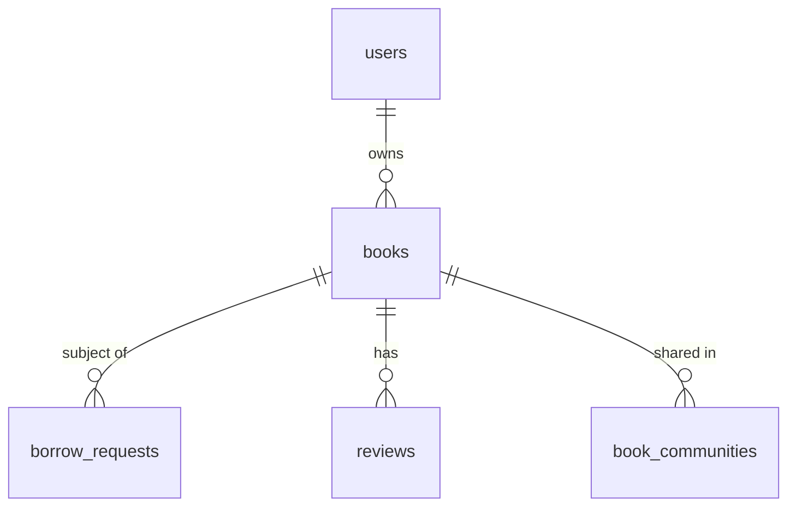

# books

## 1. What This Table Models

The `books` table represents **physical books** that users own and may lend to others. This is the core resource of the BookShare platform.

**Entity Type**: Core Entity

This table exists because:
- Each book has an owner (the user who added it)
- Books have attributes (title, author, condition)
- Books can be marked as borrowable or not
- Books can be flagged for moderation

---

## 2. Column-by-Column Deep Dive

### `id` (UUID, PRIMARY KEY, DEFAULT uuid_generate_v4())
- **Meaning**: Unique identifier for the book
- **Type Rationale**: UUID for global uniqueness, client-side generation
- **Nullable**: NOT NULL (auto-generated)
- **Default**: `uuid_generate_v4()`
- **Hidden Assumptions**: None
- **Potential Issues**: None

### `owner_id` (UUID, NOT NULL, FK)
- **Meaning**: Reference to the user who owns this book
- **Type Rationale**: UUID matches users.id
- **Nullable**: NOT NULL (every book must have an owner)
- **Default**: None
- **Hidden Assumptions**: Owner exists in users table
- **Potential Issues**: If owner deleted, book is cascade-deleted

### `title` (TEXT, NOT NULL)
- **Meaning**: Title of the book
- **Type Rationale**: TEXT for flexibility
- **Nullable**: NOT NULL (required)
- **Default**: None
- **Hidden Assumptions**: Title provided by user (may be from Google Books API)
- **Potential Issues**: No length limit, no validation

### `author` (TEXT, NOT NULL)
- **Meaning**: Author(s) of the book
- **Type Rationale**: TEXT for single author field
- **Nullable**: NOT NULL (required)
- **Default**: None
- **Hidden Assumptions**: Single author field (not normalized)
- **Potential Issues**: Multiple authors stored as comma-separated string

### `isbn` (TEXT, NULL)
- **Meaning**: International Standard Book Number
- **Type Rationale**: TEXT (ISBNs can be 10 or 13 digits, may include hyphens)
- **Nullable**: NULL (optional - older books may not have ISBN)
- **Default**: NULL
- **Hidden Assumptions**: Format not validated
- **Potential Issues**: No format validation, duplicates allowed

### `genre` (TEXT, NULL)
- **Meaning**: Book's genre/category
- **Type Rationale**: TEXT (free-form, not enum)
- **Nullable**: NULL (optional)
- **Default**: NULL
- **Hidden Assumptions**: Values should match app's genre list
- **Potential Issues**: No validation - inconsistent values possible ("Fiction" vs "fiction")

### `description` (TEXT, NULL)
- **Meaning**: Book description/synopsis
- **Type Rationale**: TEXT for long content
- **Nullable**: NULL (optional)
- **Default**: NULL
- **Hidden Assumptions**: May come from Google Books API
- **Potential Issues**: No length limit

### `cover_image_url` (TEXT, NULL)
- **Meaning**: URL to book cover image
- **Type Rationale**: TEXT for URL storage
- **Nullable**: NULL (optional)
- **Default**: NULL
- **Hidden Assumptions**: Points to Supabase Storage or external URL
- **Potential Issues**: No URL validation, could have broken links

### `condition` (TEXT, NOT NULL, CHECK)
- **Meaning**: Physical condition of the book
- **Type Rationale**: TEXT with CHECK constraint (pseudo-enum)
- **Nullable**: NOT NULL (required)
- **Default**: None
- **Check Constraint**: `condition IN ('excellent', 'good', 'fair', 'poor')`
- **Hidden Assumptions**: Owner honestly assesses condition
- **Potential Issues**: None - CHECK ensures valid values

👉 [Supabase Check Constraints](https://supabase.com/docs/guides/database/tables#check-constraints)

### `borrowable` (BOOLEAN, NOT NULL, DEFAULT TRUE)
- **Meaning**: Whether the book is available for borrowing
- **Type Rationale**: Boolean for simple yes/no
- **Nullable**: NOT NULL
- **Default**: TRUE (books are borrowable by default)
- **Hidden Assumptions**: Updated when borrow request approved/returned
- **Potential Issues**: **Denormalized** - can become stale if updates fail

### `flagged` (BOOLEAN, DEFAULT FALSE)
- **Meaning**: Whether the book has been flagged for moderation
- **Type Rationale**: Boolean for flag status
- **Nullable**: NOT NULL (DEFAULT FALSE)
- **Default**: FALSE
- **Hidden Assumptions**: Set by admin moderation
- **Potential Issues**: Flagged books still visible (no RLS restriction)

### `flagged_at` (TIMESTAMPTZ, NULL)
- **Meaning**: When the book was flagged
- **Type Rationale**: TIMESTAMPTZ for timezone-aware timestamp
- **Nullable**: NULL (only set when flagged)
- **Default**: NULL
- **Hidden Assumptions**: Set when flagged=TRUE
- **Potential Issues**: Could become stale if flagged toggled without updating

### `flagged_reason` (TEXT, NULL)
- **Meaning**: Reason for flagging (admin notes)
- **Type Rationale**: TEXT for flexible reason
- **Nullable**: NULL (only set when flagged)
- **Default**: NULL
- **Hidden Assumptions**: Set by admin
- **Potential Issues**: None

### `created_at` / `updated_at` (TIMESTAMPTZ)
- Standard timestamp fields with trigger-based updating

---

## 3. Constraints & Indexes

### Primary Key
```sql
PRIMARY KEY (id)
```

### Foreign Key
```sql
REFERENCES public.users(id) ON DELETE CASCADE
```
- Books deleted when owner deleted

### Check Constraint
```sql
CHECK (condition IN ('excellent', 'good', 'fair', 'poor'))
```
- Enforces valid condition values

### Indexes
```sql
CREATE INDEX books_owner_id_idx ON public.books(owner_id);
CREATE INDEX books_genre_idx ON public.books(genre);
CREATE INDEX books_borrowable_idx ON public.books(borrowable);
CREATE INDEX books_title_author_idx ON public.books
  USING gin(to_tsvector('english', title || ' ' || author));
CREATE INDEX idx_books_flagged ON books(flagged);
```

| Index | Type | Purpose |
|-------|------|---------|
| `books_owner_id_idx` | BTREE | Fast lookup by owner |
| `books_genre_idx` | BTREE | Filter by genre |
| `books_borrowable_idx` | BTREE | Filter available books |
| `books_title_author_idx` | GIN | **Full-text search** on title/author |
| `idx_books_flagged` | BTREE | Admin moderation queries |

👉 [Supabase Indexes](https://supabase.com/docs/guides/database/postgres/indexes)
👉 [Full-Text Search](https://supabase.com/docs/guides/database/full-text-search)

### Triggers
```sql
CREATE TRIGGER update_books_updated_at BEFORE UPDATE ON public.books
  FOR EACH ROW EXECUTE FUNCTION update_updated_at_column();

CREATE TRIGGER trigger_log_book_addition AFTER INSERT ON books
  FOR EACH ROW EXECUTE FUNCTION log_book_addition();
```

---

## 4. Relationships to Other Tables



### Relationships

| Related Table | Relationship | FK Column | On Delete |
|---------------|--------------|-----------|-----------|
| `users` | many:1 | `owner_id` | CASCADE |
| `borrow_requests` | 1:many | `book_id` | CASCADE |
| `reviews` | 1:many | `book_id` | CASCADE |
| `book_communities` | 1:many | `book_id` | CASCADE |

**Design Note**: A book can only have ONE owner. If ownership transfer is needed, a new borrow_request flow or separate mechanism would be required.

---

## 5. RLS (Row-Level Security) Rules

RLS is **ENABLED** on this table.

### Policies

| Policy | Operation | Rule | Purpose |
|--------|-----------|------|---------|
| "Anyone can view books" | SELECT | `USING (true)` | Public book catalog |
| "Users can insert own books" | INSERT | `WITH CHECK (auth.uid() = owner_id)` | Only add own books |
| "Users can update own books" | UPDATE | `USING (auth.uid() = owner_id)` | Only edit own books |
| "Users can delete own books" | DELETE | `USING (auth.uid() = owner_id)` | Only delete own books |
| "Admins can view all books" | SELECT | Admin subquery | Admin access |

### Edge Cases

1. **Flagged books still visible** - No RLS hides flagged content
2. **Borrowability check in api-client** - RLS doesn't restrict based on `borrowable`
3. **Admin can view but not edit** - No admin UPDATE policy for moderation

👉 [Supabase Row Level Security](https://supabase.com/docs/guides/auth/row-level-security)

---

## 6. How This Table Is Used in the api-client

### Query Locations

```typescript
// books.ts
.from('books').select('*')                              // getBooks
.from('books').select('*').eq('id', id)                // getBook
.from('books').select(`*, owner:users!owner_id (...)`) // getBooksWithOwners
.from('books').insert({...})                           // createBook
.from('books').update({...}).eq('id', id)              // updateBook
.from('books').delete().eq('id', id)                   // deleteBook
.from('books').update({ borrowable: false })           // approveBorrowRequest

// admin.ts
.from('books').select('*')                             // getAllBooks
.from('books').update({ flagged: true, ... })          // flagBook
```

### Query Analysis

| Query | Optimal? | Index Used? | Notes |
|-------|----------|-------------|-------|
| Get by ID | Yes | PK | Primary key lookup |
| Get by owner | Yes | `books_owner_id_idx` | Fast |
| Search title/author | Yes | `books_title_author_idx` | GIN index exists |
| Filter by genre | Yes | `books_genre_idx` | Index exists |
| Filter by borrowable | Yes | `books_borrowable_idx` | Index exists |
| Get with owner join | Yes | Embedded resource | Single query |

### RLS Interactions

- All users can read all books (public catalog)
- Only owner can modify their books
- `borrowable` updated by borrow workflow (owner's permission)

---

## 7. Alternative Schema Designs

### Alternative A: Normalize Authors

```sql
CREATE TABLE authors (
  id UUID PRIMARY KEY,
  name TEXT NOT NULL
);

CREATE TABLE book_authors (
  book_id UUID REFERENCES books(id),
  author_id UUID REFERENCES authors(id),
  position INTEGER -- 1st author, 2nd author, etc.
);
```

**Pros**: Handle multiple authors, author pages, deduplication
**Cons**: More complex, overkill for current needs

### Alternative B: Genre as Enum

```sql
CREATE TYPE book_genre AS ENUM (
  'Fiction', 'Non-Fiction', 'Science Fiction', 'Fantasy',
  'Mystery', 'Romance', 'Biography', 'History', 'Self-Help', 'Other'
);

ALTER TABLE books ALTER COLUMN genre TYPE book_genre;
```

**Pros**: Enforces valid genres, enables autocompletion
**Cons**: Migration required to add new genres

👉 [Supabase Enums](https://supabase.com/docs/guides/database/enums)

### Alternative C: Compute `borrowable` from borrow_requests

Instead of storing `borrowable`, compute it:
```sql
CREATE VIEW available_books AS
SELECT * FROM books b
WHERE NOT EXISTS (
  SELECT 1 FROM borrow_requests br
  WHERE br.book_id = b.id
  AND br.status IN ('approved', 'borrowed', 'return_initiated')
);
```

**Pros**: Always accurate, no sync issues
**Cons**: Slower queries, can't use simple boolean filter

**Recommendation**: Keep current design but ensure atomic updates in borrow workflow.

---

## 8. Scalability Considerations

### Query Performance at Scale

| Operation | 10K Books | 100K Books | 1M Books |
|-----------|-----------|------------|----------|
| Get by ID | Fast | Fast | Fast |
| Full-text search | Fast | Fast | Moderate |
| Filter by genre | Fast | Fast | Fast |
| Get all (no filter) | Slow | Very Slow | Unusable |

### Index Effectiveness

- **GIN index for search**: Handles full-text search efficiently
- **BTREE indexes**: All filter columns have indexes
- **No pagination in some queries**: Could return huge datasets

### Recommendations

1. **Always paginate** book listings
2. **Consider partitioning** by `created_at` if 1M+ books
3. **Monitor GIN index size** - can grow large

### Storage Growth

- ~1KB per book (excluding cover images in Storage)
- 100K books ≈ 100MB
- Cover images stored separately in Supabase Storage

---

## 9. Suggested Improvements

### Schema Changes

```sql
-- Add ISBN validation
ALTER TABLE books ADD CONSTRAINT valid_isbn
  CHECK (isbn IS NULL OR isbn ~ '^[0-9X-]{10,17}$');

-- Add genre enum (optional)
CREATE TYPE book_genre AS ENUM ('Fiction', 'Non-Fiction', ...);

-- Add page count (from Google Books API)
ALTER TABLE books ADD COLUMN page_count INTEGER;

-- Add publication year
ALTER TABLE books ADD COLUMN published_year INTEGER;
```

### RLS Improvements

```sql
-- Hide flagged books from non-admins
DROP POLICY "Anyone can view books" ON books;
CREATE POLICY "Anyone can view non-flagged books"
  ON books FOR SELECT
  USING (
    flagged = FALSE
    OR EXISTS (SELECT 1 FROM users WHERE id = auth.uid() AND is_admin = TRUE)
  );
```

### Index Improvements

```sql
-- Composite index for common filter combination
CREATE INDEX books_borrowable_genre_idx ON books(borrowable, genre)
  WHERE borrowable = TRUE;
```

### Pitfall Warnings

1. **`borrowable` sync risk**: Must update atomically with borrow_request status
2. **Genre inconsistency**: Free-form text allows "Fiction", "fiction", "FICTION"
3. **Cover URL broken links**: No validation, could have dead URLs
4. **Author field limitation**: Single TEXT field can't properly handle multiple authors

---

## 10. Summary

### Strengths
- Full-text search index pre-configured
- Comprehensive indexes for all filter patterns
- Clean foreign key to owner
- Condition uses CHECK constraint (pseudo-enum)
- Activity logging trigger in place

### Weaknesses
- `borrowable` is denormalized (sync risk)
- Genre is free-form text (inconsistency risk)
- Author is single field (can't handle multiple authors properly)
- Flagged books not hidden by RLS

### Key Development Reminders
- Always update `borrowable` atomically with borrow_request status
- Use consistent genre values (consider frontend dropdown)
- Validate ISBN format in application layer
- Paginate all book listings
- Cover images stored in Supabase Storage, not in this table
