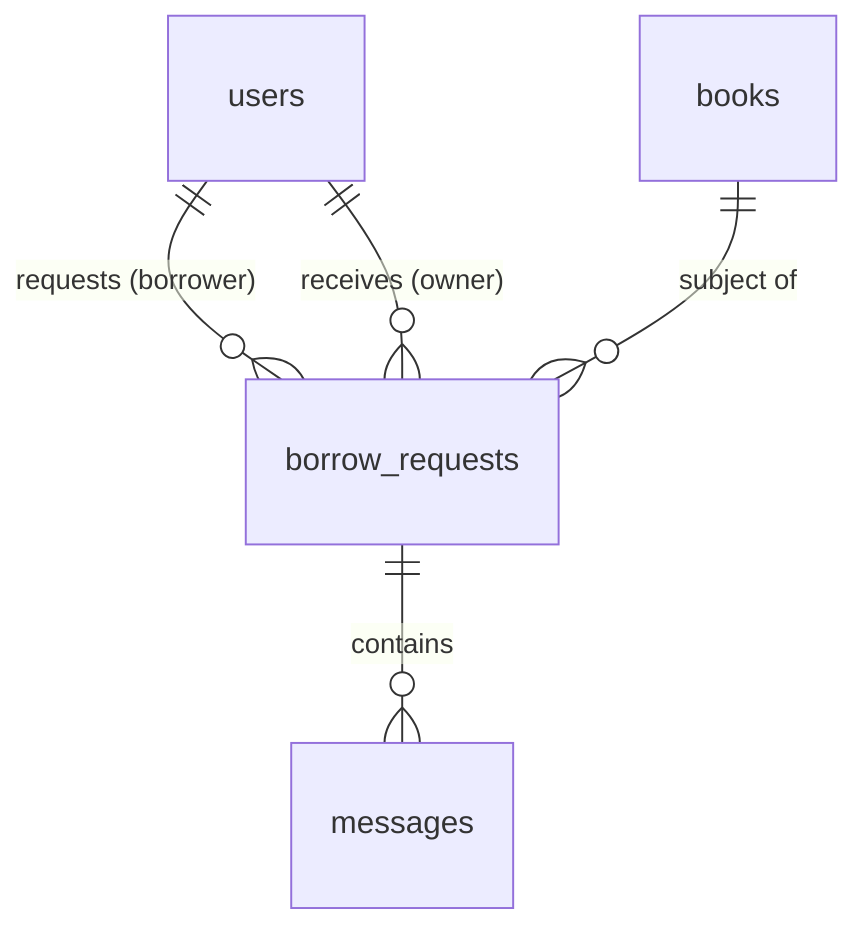

# borrow_requests

## 1. What This Table Models

The `borrow_requests` table represents the **borrowing workflow** - the lifecycle of a book being requested, approved, handed over, borrowed, and returned. This is an **event/transaction entity** that tracks state over time.

**Entity Type**: Transaction/Event Entity (State Machine)

This table exists because:
- Tracks the multi-step borrowing process
- Records both parties (owner and borrower)
- Maintains history of all borrow transactions
- Enables chat between parties

---

## 2. Column-by-Column Deep Dive

### Core Identifiers

#### `id` (UUID, PRIMARY KEY)
- **Meaning**: Unique identifier for the borrow request
- **Type**: UUID with auto-generation
- **Default**: `uuid_generate_v4()`

#### `book_id` (UUID, NOT NULL, FK)
- **Meaning**: The book being borrowed
- **Cascade**: ON DELETE CASCADE (if book deleted, request deleted)

#### `borrower_id` (UUID, NOT NULL, FK)
- **Meaning**: User requesting to borrow
- **Constraint**: Cannot equal `owner_id` (no self-borrowing)

#### `owner_id` (UUID, NOT NULL, FK)
- **Meaning**: Owner of the book (denormalized from books.owner_id)
- **Why Denormalized**: Faster queries for "incoming requests" without join
- **Risk**: Could become stale if book ownership transferred (not currently supported)

### Status & Workflow

#### `status` (TEXT, NOT NULL, CHECK)
- **Meaning**: Current state in the borrowing workflow
- **Valid Values**: `pending`, `approved`, `borrowed`, `return_initiated`, `returned`, `denied`
- **Default**: `pending`
- **State Machine**:
  ```
  pending → approved → borrowed → return_initiated → returned
      └──→ denied
  ```

#### `request_message` (TEXT, NULL)
- **Meaning**: Message from borrower when requesting

#### `response_message` (TEXT, NULL)
- **Meaning**: Message from owner when approving/denying

### Timestamps

#### `requested_at` (TIMESTAMPTZ, NOT NULL, DEFAULT NOW())
- **Meaning**: When request was created

#### `approved_at` (TIMESTAMPTZ, NULL)
- **Meaning**: When owner approved the request

#### `due_date` (TIMESTAMPTZ, NULL)
- **Meaning**: When book should be returned

#### `returned_at` (TIMESTAMPTZ, NULL)
- **Meaning**: When book was actually returned

### Handover Fields (Getting Book to Borrower)

#### `handover_method` (TEXT, CHECK)
- **Values**: `ship`, `meetup`, `pickup`
- **Meaning**: How book will be delivered

#### `handover_address` (TEXT, NULL)
- **Meaning**: Shipping address or meetup location

#### `handover_datetime` (TIMESTAMPTZ, NULL)
- **Meaning**: Scheduled meetup/pickup time

#### `handover_instructions` (TEXT, NULL)
- **Meaning**: Special instructions (e.g., "Ring doorbell")

#### `handover_tracking` (TEXT, NULL)
- **Meaning**: Shipping tracking number

#### `handover_completed_at` (TIMESTAMPTZ, NULL)
- **Meaning**: When borrower received book

### Return Fields (Getting Book Back to Owner)

#### `return_method` (TEXT, CHECK)
- **Values**: `ship`, `meetup`, `dropoff`

#### `return_address` (TEXT, NULL)
- **Meaning**: Return shipping address

#### `return_datetime` (TIMESTAMPTZ, NULL)
- **Meaning**: Scheduled return meetup

#### `return_instructions` (TEXT, NULL)
- **Meaning**: Return instructions

#### `return_tracking` (TEXT, NULL)
- **Meaning**: Return shipping tracking

#### `return_initiated_at` (TIMESTAMPTZ, NULL)
- **Meaning**: When borrower started return process

### Chat Optimization (Denormalized)

#### `last_message_at` (TIMESTAMPTZ, NULL)
- **Meaning**: Timestamp of most recent message
- **Why Denormalized**: Sort chat list without joining messages

#### `last_message_content` (TEXT, NULL)
- **Meaning**: First 100 chars of last message
- **Why Denormalized**: Show preview without joining

---

## 3. Constraints & Indexes

### Primary Key
```sql
PRIMARY KEY (id)
```

### Foreign Keys
```sql
REFERENCES public.books(id) ON DELETE CASCADE
REFERENCES public.users(id) ON DELETE CASCADE -- borrower_id
REFERENCES public.users(id) ON DELETE CASCADE -- owner_id
```

### Check Constraints
```sql
CHECK (status IN ('pending', 'approved', 'borrowed', 'return_initiated', 'returned', 'denied'))
CHECK (borrower_id != owner_id)  -- no_self_borrow
CHECK (handover_method IN ('ship', 'meetup', 'pickup'))
CHECK (return_method IN ('ship', 'meetup', 'dropoff'))
```

### Unique Constraint (Partial)
```sql
-- From migration 005
CREATE UNIQUE INDEX unique_active_borrow_request
ON borrow_requests (book_id, borrower_id)
WHERE status IN ('pending', 'approved');
```
This prevents duplicate active requests for the same book from the same borrower.

### Indexes
```sql
CREATE INDEX borrow_requests_book_id_idx ON public.borrow_requests(book_id);
CREATE INDEX borrow_requests_borrower_id_idx ON public.borrow_requests(borrower_id);
CREATE INDEX borrow_requests_owner_id_idx ON public.borrow_requests(owner_id);
CREATE INDEX borrow_requests_status_idx ON public.borrow_requests(status);
CREATE INDEX borrow_requests_last_message_at_idx ON public.borrow_requests(last_message_at DESC NULLS LAST);
```

### Triggers
```sql
-- Update timestamps
CREATE TRIGGER update_borrow_requests_updated_at ...

-- Log activity
CREATE TRIGGER trigger_log_borrow_request_action ...

-- Update last_message (from messages)
-- Trigger on messages table updates borrow_requests.last_message_*
```

---

## 4. Relationships to Other Tables



### Relationships

| Related Table | Relationship | FK Column | Notes |
|---------------|--------------|-----------|-------|
| `books` | many:1 | `book_id` | Book being borrowed |
| `users` | many:1 | `borrower_id` | Person borrowing |
| `users` | many:1 | `owner_id` | Book owner |
| `messages` | 1:many | `borrow_request_id` | Chat messages |

---

## 5. RLS (Row-Level Security) Rules

RLS is **ENABLED** on this table.

### Policies

| Policy | Operation | Rule |
|--------|-----------|------|
| "Users can view relevant borrow requests" | SELECT | `borrower_id = auth.uid() OR owner_id = auth.uid()` |
| "Users can create borrow requests" | INSERT | `auth.uid() = borrower_id` |
| "Owners can update borrow requests" | UPDATE | `owner_id = auth.uid() OR borrower_id = auth.uid()` |
| "Users can delete own pending requests" | DELETE | `borrower_id = auth.uid() AND status = 'pending'` |
| "Admins can view all borrow_requests" | SELECT | Admin subquery |

### Edge Cases

1. **Both parties can UPDATE** - Needed for borrower to initiate return, owner to approve
2. **DELETE only for pending** - Can't delete active/completed requests
3. **No RLS for status transitions** - Application must enforce valid transitions

👉 [Supabase Row Level Security](https://supabase.com/docs/guides/auth/row-level-security)

---

## 6. How This Table Is Used in the api-client

### Query Locations

```typescript
// borrowRequests.ts
.from('borrow_requests').select('*')                    // getBorrowRequests
.from('borrow_requests').select(`*, book:books!book_id(...)`) // with details
.from('borrow_requests').insert({...})                  // createBorrowRequest
.from('borrow_requests').update({...})                  // approveBorrowRequest, etc.
.from('borrow_requests').or(`owner_id.eq.${uid},borrower_id.eq.${uid}`) // getActiveChats

// messages.ts
.from('borrow_requests').select('id, owner_id, borrower_id')  // getTotalUnreadCount
```

### Query Analysis

| Query | Optimal? | Notes |
|-------|----------|-------|
| Get by book_id | Yes | Index exists |
| Get by borrower_id | Yes | Index exists |
| Get by owner_id | Yes | Index exists |
| Get active chats | Yes | last_message_at index |
| Check duplicate | Yes | Partial unique index |

### Critical Operations

1. **approveBorrowRequest**: Updates status + updates `books.borrowable = false`
2. **markBookReturned**: Updates status + updates `books.borrowable = true`

**Risk**: These are NOT atomic - if second update fails, data becomes inconsistent.

---

## 7. Alternative Schema Designs

### Alternative A: Event Sourcing

```sql
CREATE TABLE borrow_events (
  id UUID PRIMARY KEY,
  request_id UUID REFERENCES borrow_requests(id),
  event_type TEXT, -- 'requested', 'approved', 'handed_over', etc.
  payload JSONB,
  created_at TIMESTAMPTZ
);
```

**Pros**: Full history, audit trail, can replay events
**Cons**: Complex to query current state

### Alternative B: Separate Handover Table

```sql
CREATE TABLE handovers (
  id UUID PRIMARY KEY,
  borrow_request_id UUID REFERENCES borrow_requests(id),
  type TEXT CHECK (type IN ('initial', 'return')),
  method TEXT,
  address TEXT,
  datetime TIMESTAMPTZ,
  instructions TEXT,
  tracking TEXT,
  completed_at TIMESTAMPTZ
);
```

**Pros**: Cleaner schema, reusable handover logic
**Cons**: Extra join for every request detail view

### Alternative C: Don't Denormalize owner_id

Remove `owner_id`, always join through books:
```sql
SELECT br.*, b.owner_id
FROM borrow_requests br
JOIN books b ON br.book_id = b.id
```

**Pros**: Single source of truth
**Cons**: Slower queries, more complex RLS

**Recommendation**: Current design is reasonable. Consider moving handover/return to separate table if schema grows more complex.

---

## 8. Scalability Considerations

### Query Performance at Scale

| Operation | 10K Requests | 100K Requests | 1M Requests |
|-----------|--------------|---------------|-------------|
| Get by borrower | Fast | Fast | Fast |
| Get active chats | Fast | Fast | Moderate |
| Dashboard counts | Fast | Moderate | Use materialized view |

### Index Effectiveness

All common query patterns have indexes. The partial unique index efficiently prevents duplicates.

### Recommendations

1. **Archive old requests** - Move `returned`/`denied` to history table
2. **Partition by created_at** - If 1M+ requests
3. **Atomic status transitions** - Use RPC functions

### Storage Growth

- ~2KB per request (with all fields)
- 100K requests ≈ 200MB

---

## 9. Suggested Improvements

### Schema Changes

```sql
-- Add cancellation tracking
ALTER TABLE borrow_requests ADD COLUMN cancelled_at TIMESTAMPTZ;
ALTER TABLE borrow_requests ADD COLUMN cancelled_by UUID REFERENCES users(id);
ALTER TABLE borrow_requests ADD COLUMN cancellation_reason TEXT;

-- Add overdue flag (computed or trigger-maintained)
ALTER TABLE borrow_requests ADD COLUMN is_overdue BOOLEAN DEFAULT FALSE;

-- Create function for atomic status transition
CREATE FUNCTION transition_borrow_status(
  request_id UUID,
  new_status TEXT,
  additional_data JSONB
) RETURNS borrow_requests AS $$
  -- Validates transition, updates book.borrowable atomically
$$ LANGUAGE plpgsql;
```

### RLS Improvements

```sql
-- Restrict status updates by role
CREATE POLICY "Only owner can approve/deny"
  ON borrow_requests FOR UPDATE
  USING (
    auth.uid() = owner_id
    AND status = 'pending'
  )
  WITH CHECK (
    new.status IN ('approved', 'denied')
  );
```

### Atomic Transitions (RPC)

```sql
CREATE FUNCTION approve_borrow_request(
  p_request_id UUID,
  p_due_date TIMESTAMPTZ,
  p_handover_details JSONB
) RETURNS borrow_requests
LANGUAGE plpgsql
AS $$
BEGIN
  -- Update book in same transaction
  UPDATE books SET borrowable = false
  WHERE id = (SELECT book_id FROM borrow_requests WHERE id = p_request_id);

  -- Update request
  UPDATE borrow_requests
  SET status = 'approved', ...
  WHERE id = p_request_id
  RETURNING *;
END;
$$;
```

### Pitfall Warnings

1. **Non-atomic book.borrowable update** - Must be fixed for production
2. **Denormalized owner_id** - Could become stale (low risk currently)
3. **No status transition validation** - Application must enforce valid transitions
4. **last_message_* sync** - Trigger-maintained, verify it works

---

## 10. Summary

### Strengths
- Comprehensive state machine for borrowing workflow
- Partial unique index prevents duplicate active requests
- Denormalized chat fields for performance
- All query patterns have indexes
- Handover/return logistics fully modeled

### Weaknesses
- Non-atomic multi-table updates (book.borrowable)
- Many nullable columns (sparse data)
- No validation of status transitions in schema
- Denormalized owner_id could become stale

### Key Development Reminders
- Always use transactions when changing status + book.borrowable
- Validate status transitions in application code
- Check `no_self_borrow` constraint before insert
- Use partial unique index for duplicate prevention
- Archive old requests if table grows too large
