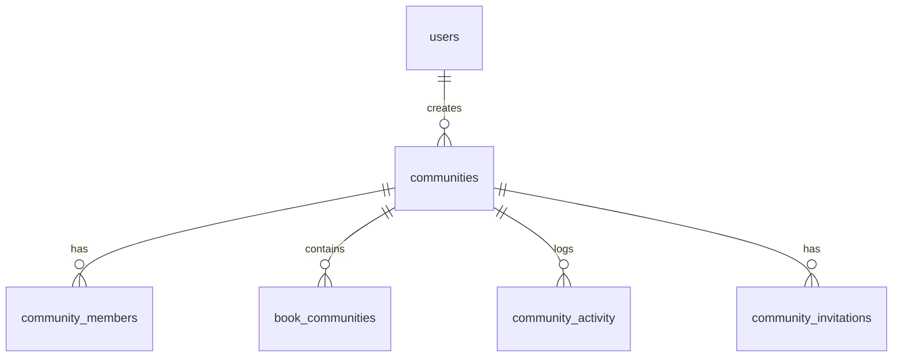

# communities

## 1. What This Table Models

The `communities` table represents **groups/communities** where users can share books with each other. Communities can be public or private, and may require approval to join.

**Entity Type**: Core Entity (Aggregate Root)

This table exists because:
- Users want to share books within groups (neighborhoods, book clubs, etc.)
- Communities have privacy and approval settings
- Each community has a creator/owner
- Communities aggregate members and books

---

## 2. Column-by-Column Deep Dive

### `id` (UUID, PRIMARY KEY)
- **Meaning**: Unique identifier for the community
- **Default**: `uuid_generate_v4()`

### `name` (TEXT, NOT NULL)
- **Meaning**: Community display name
- **Potential Issues**: No length limit, no uniqueness constraint

### `description` (TEXT, NULL)
- **Meaning**: Community description/purpose
- **Nullable**: Optional
- **Potential Issues**: No length limit

### `avatar_url` (TEXT, NULL)
- **Meaning**: Community profile image URL
- **Note**: Points to Supabase Storage

### `location` (TEXT, NULL)
- **Meaning**: Geographic location (city, neighborhood)
- **Added**: Migration 015
- **Potential Issues**: Free-form text, no geolocation support

### `is_private` (BOOLEAN, NOT NULL, DEFAULT FALSE)
- **Meaning**: Whether community is visible to non-members
- **Default**: FALSE (public)
- **Note**: Private communities only visible to members

### `requires_approval` (BOOLEAN, NOT NULL, DEFAULT TRUE)
- **Meaning**: Whether joining requires admin approval
- **Default**: TRUE
- **Note**: Affects join workflow

### `created_by` (UUID, NOT NULL, FK)
- **Meaning**: User who created the community
- **Note**: Historical - current owner tracked in community_members

### `created_at` / `updated_at` (TIMESTAMPTZ)
- Standard timestamp fields

---

## 3. Constraints & Indexes

### Primary Key
```sql
PRIMARY KEY (id)
```

### Foreign Key
```sql
REFERENCES public.users(id) ON DELETE CASCADE
```

### Indexes
```sql
CREATE INDEX communities_created_by_idx ON public.communities(created_by);
CREATE INDEX communities_is_private_idx ON public.communities(is_private);
CREATE INDEX communities_name_search_idx ON public.communities
  USING gin(to_tsvector('english', name || ' ' || COALESCE(description, '')));
```

| Index | Type | Purpose |
|-------|------|---------|
| `communities_created_by_idx` | BTREE | Get user's created communities |
| `communities_is_private_idx` | BTREE | Filter public communities |
| `communities_name_search_idx` | GIN | Full-text search on name/description |

### Triggers
```sql
-- Update timestamp
CREATE TRIGGER update_communities_updated_at BEFORE UPDATE ON public.communities
  FOR EACH ROW EXECUTE FUNCTION update_updated_at_column();

-- Auto-add creator as owner
CREATE TRIGGER add_creator_as_owner AFTER INSERT ON public.communities
  FOR EACH ROW EXECUTE FUNCTION add_community_creator_as_owner();

-- Track creation activity
CREATE TRIGGER track_community_created_trigger AFTER INSERT ON public.communities
  FOR EACH ROW EXECUTE FUNCTION track_community_created();

-- Track updates
CREATE TRIGGER track_community_updated_trigger AFTER UPDATE ON public.communities
  FOR EACH ROW EXECUTE FUNCTION track_community_updated();
```

---

## 4. Relationships to Other Tables



### Relationships

| Related Table | Relationship | FK Column |
|---------------|--------------|-----------|
| `users` | many:1 | `created_by` |
| `community_members` | 1:many | `community_id` |
| `book_communities` | 1:many | `community_id` |
| `community_activity` | 1:many | `community_id` |
| `community_invitations` | 1:many | `community_id` |

---

## 5. RLS (Row-Level Security) Rules

RLS is **ENABLED** on this table.

### Helper Functions (SECURITY DEFINER)

```sql
-- Check if user is approved member
CREATE FUNCTION is_community_member(community_id_param UUID, user_id_param UUID)
RETURNS BOOLEAN AS $$
  SELECT EXISTS (
    SELECT 1 FROM public.community_members
    WHERE community_id = community_id_param
    AND user_id = user_id_param
    AND status = 'approved'
  );
$$ LANGUAGE plpgsql SECURITY DEFINER;

-- Check if user is admin/owner
CREATE FUNCTION is_community_admin(community_id_param UUID, user_id_param UUID)
RETURNS BOOLEAN AS $$
  SELECT EXISTS (
    SELECT 1 FROM public.community_members
    WHERE community_id = community_id_param
    AND user_id = user_id_param
    AND role IN ('owner', 'admin')
    AND status = 'approved'
  );
$$ LANGUAGE plpgsql SECURITY DEFINER;
```

These functions use `SECURITY DEFINER` to bypass RLS when checking membership (avoids infinite recursion).

👉 [Supabase Security Definer Functions](https://supabase.com/docs/guides/database/functions#security-definer-vs-invoker)

### Policies

| Policy | Operation | Rule |
|--------|-----------|------|
| "Anyone can view public communities" | SELECT | `is_private = false OR is_community_member(id, auth.uid())` |
| "Authenticated users can create communities" | INSERT | `auth.uid() = created_by` |
| "Owners and admins can update communities" | UPDATE | `is_community_admin(id, auth.uid())` |
| "Owners can delete communities" | DELETE | `is_community_owner(id, auth.uid())` |

### Edge Cases

1. **Private visibility** - Only members see private communities
2. **Admin can update, owner can delete** - Roles matter
3. **Helper functions avoid RLS recursion** - Critical for policies

👉 [Supabase Row Level Security](https://supabase.com/docs/guides/auth/row-level-security)

---

## 6. How This Table Is Used in the api-client

### Query Locations

```typescript
// communities.ts
.from('communities').select('*').eq('is_private', false)      // getCommunities (public)
.from('communities').select('*').eq('id', communityId)        // getCommunityById
.from('communities').insert({ name, description, ... })        // createCommunity
.from('communities').update({ name, ... }).eq('id', id)       // updateCommunity
.from('communities').delete().eq('id', id)                     // deleteCommunity
```

### Query Analysis

| Query | Optimal? | Notes |
|-------|----------|-------|
| Get public communities | Yes | Index on is_private |
| Search by name | Yes | GIN index exists |
| Get by ID | Yes | Primary key |
| Get user's communities | Indirect | Goes through community_members |

### Computed Fields in api-client

The api-client adds computed fields:
```typescript
interface Community {
  // ... stored fields ...
  memberCount?: number;  // Computed
  bookCount?: number;    // Computed
  userRole?: 'owner' | 'admin' | 'member';  // Computed
  userStatus?: 'approved' | 'pending';  // Computed
}
```

These require additional queries to `community_members` and `book_communities`.

---

## 7. Alternative Schema Designs

### Alternative A: Denormalize Counts

```sql
ALTER TABLE communities ADD COLUMN member_count INTEGER DEFAULT 0;
ALTER TABLE communities ADD COLUMN book_count INTEGER DEFAULT 0;

-- Triggers to maintain counts
```

**Pros**: O(1) count lookup
**Cons**: Trigger complexity, slight inconsistency window

### Alternative B: Enum for Privacy

```sql
CREATE TYPE community_access AS ENUM ('public', 'private_open', 'private_approval');
ALTER TABLE communities ADD COLUMN access_mode community_access;
```

Instead of two booleans (`is_private`, `requires_approval`).

**Pros**: Single field, clearer semantics
**Cons**: Migration needed

### Alternative C: Location as Geometry

```sql
ALTER TABLE communities ADD COLUMN location_point GEOGRAPHY(POINT, 4326);
CREATE INDEX communities_location_idx ON communities USING GIST(location_point);
```

Enable "communities near me" queries.

**Pros**: Real geolocation, proximity search
**Cons**: PostGIS required, more complex

**Recommendation**: Consider denormalizing counts. Keep privacy as-is (flexible). Add geolocation if location-based discovery needed.

---

## 8. Scalability Considerations

### Query Performance at Scale

| Operation | 1K Communities | 100K Communities |
|-----------|----------------|------------------|
| List public | Fast | Needs pagination |
| Search | Fast | GIN handles well |
| Get member count | Moderate | Slow (per-community count) |

### Recommendations

1. **Denormalize counts** - Avoid COUNT(*) on large tables
2. **Paginate listings** - Don't load all communities
3. **Cache popular communities** - If discovery is frequent

---

## 9. Suggested Improvements

### Schema Changes

```sql
-- Add member/book counts
ALTER TABLE communities ADD COLUMN member_count INTEGER DEFAULT 0;
ALTER TABLE communities ADD COLUMN book_count INTEGER DEFAULT 0;

-- Add slug for URLs
ALTER TABLE communities ADD COLUMN slug TEXT UNIQUE;

-- Add visibility categories
ALTER TABLE communities ADD COLUMN category TEXT;
```

### RLS Improvements

Already well-designed with helper functions.

### Index Improvements

```sql
-- For discovery queries
CREATE INDEX communities_public_created_idx
  ON communities(created_at DESC)
  WHERE is_private = FALSE;
```

### Pitfall Warnings

1. **Owner vs created_by confusion** - `created_by` is historical, owner is in community_members
2. **Two-boolean privacy** - 4 combinations, not all meaningful
3. **Computed counts expensive** - Consider denormalization
4. **No name uniqueness** - Duplicate community names allowed

---

## 10. Summary

### Strengths
- Clear privacy controls
- Helper functions prevent RLS recursion
- Full-text search enabled
- Automatic owner membership via trigger

### Weaknesses
- Counts require computation
- No slug for SEO-friendly URLs
- Location is free-form text
- Name not unique

### Key Development Reminders
- Owner role is in `community_members`, not `communities.created_by`
- Use helper functions (`is_community_member`, `is_community_admin`) for role checks
- Private communities only visible to members
- Trigger auto-adds creator as owner on insert
