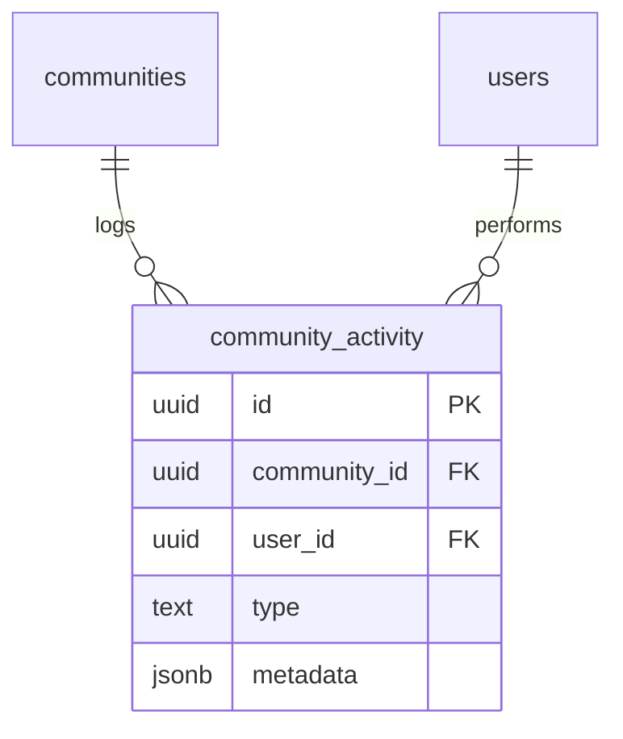

# community_activity

## 1. What This Table Models

The `community_activity` table represents the **activity feed** for communities - a log of all significant events like members joining, books being added, role changes, etc.

**Entity Type**: Event/Audit Log Entity

This table exists because:
- Communities need an activity feed
- Track member actions for transparency
- Historical record of community events
- Support activity-based notifications

---

## 2. Column-by-Column Deep Dive

### `id` (UUID, PRIMARY KEY)
- **Meaning**: Unique identifier for the activity entry
- **Default**: `uuid_generate_v4()`

### `community_id` (UUID, NOT NULL, FK)
- **Meaning**: The community this activity belongs to
- **Cascade**: ON DELETE CASCADE

### `type` (TEXT, NOT NULL, CHECK)
- **Meaning**: Category of activity
- **Valid Values** (expanded in migration 019):
  - Member: `member_joined`, `member_left`, `member_removed`, `member_role_changed`
  - Join requests: `join_request_created`, `join_request_approved`, `join_request_denied`
  - Invitations: `user_invited`, `invitation_accepted`, `invitation_rejected`, `invitation_cancelled`
  - Books: `book_added`, `book_removed`
  - Community: `community_created`, `community_updated`, `community_deleted`, `ownership_transferred`
  - Legacy: `borrow_created`, `borrow_returned`, `review_posted`

### `user_id` (UUID, NOT NULL, FK)
- **Meaning**: User who performed the action
- **Cascade**: ON DELETE CASCADE

### `metadata` (JSONB, NULL)
- **Meaning**: Additional activity-specific data
- **Examples**:
  - `{ "member_id": "...", "role": "admin" }`
  - `{ "book_id": "...", "added_by": "..." }`
  - `{ "old_role": "member", "new_role": "admin" }`

### `created_at` (TIMESTAMPTZ, NOT NULL, DEFAULT NOW())
- **Meaning**: When the activity occurred

---

## 3. Constraints & Indexes

### Primary Key
```sql
PRIMARY KEY (id)
```

### Foreign Keys
```sql
REFERENCES public.communities(id) ON DELETE CASCADE
REFERENCES public.users(id) ON DELETE CASCADE
```

### Check Constraint
```sql
CHECK (type IN (
  'member_joined', 'member_left', 'member_removed', 'member_role_changed',
  'join_request_created', 'join_request_approved', 'join_request_denied',
  'user_invited', 'invitation_accepted', 'invitation_rejected', 'invitation_cancelled',
  'book_added', 'book_removed',
  'community_created', 'community_updated', 'community_deleted', 'ownership_transferred',
  'borrow_created', 'borrow_returned', 'review_posted'
))
```

### Indexes
```sql
CREATE INDEX community_activity_community_id_idx ON public.community_activity(community_id);
CREATE INDEX community_activity_type_idx ON public.community_activity(type);
CREATE INDEX community_activity_created_at_idx ON public.community_activity(created_at DESC);
```

---

## 4. Relationships to Other Tables



### Relationships

| Related Table | Relationship | Notes |
|---------------|--------------|-------|
| `communities` | many:1 | Parent community |
| `users` | many:1 | Acting user |

### Soft References (in metadata)

The `metadata` JSONB may reference:
- `member_id` → users.id
- `book_id` → books.id
- `inviter_id`, `invitee_id` → users.id

These are NOT enforced foreign keys.

---

## 5. RLS (Row-Level Security) Rules

RLS is **ENABLED** on this table.

### Policies

| Policy | Operation | Rule |
|--------|-----------|------|
| "Members can view activity in their communities" | SELECT | Member OR public community |
| "Authenticated users can create activity" | INSERT | `auth.uid() = user_id` |

### SELECT Policy Detail

```sql
CREATE POLICY "Members can view activity in their communities"
  ON public.community_activity FOR SELECT
  USING (
    is_community_member(community_id, auth.uid())
    OR EXISTS (
      SELECT 1 FROM public.communities c
      WHERE c.id = community_id
      AND c.is_private = false
    )
  );
```

### No UPDATE/DELETE Policies

Activity log is append-only - entries cannot be modified or deleted by users.

👉 [Supabase Row Level Security](https://supabase.com/docs/guides/auth/row-level-security)

---

## 6. How This Table Is Used in the api-client

### Query Locations

```typescript
// communities.ts
.from('community_activity')
.select('*')
.eq('community_id', communityId)
.order('created_at', { ascending: false })
.limit(limit)                                    // getCommunityActivity

.from('community_activity')
.insert({
  community_id,
  type,
  user_id,
  metadata
})                                               // createActivity (rarely direct, usually via triggers)
```

### Query Analysis

| Query | Optimal? | Notes |
|-------|----------|-------|
| Get recent activity | Yes | Index on created_at DESC |
| Filter by type | Yes | Index on type |
| Get all activity | Moderate | Needs pagination |

### Trigger-Based Population

Most activity entries are created via triggers, not direct API calls:

```sql
-- Member joins → trigger creates 'member_joined'
-- Book added → trigger creates 'book_added'
-- Role changed → trigger creates 'member_role_changed'
```

---

## 7. Alternative Schema Designs

### Alternative A: Polymorphic References

```sql
ALTER TABLE community_activity
  ADD COLUMN entity_type TEXT,  -- 'user', 'book', 'invitation'
  ADD COLUMN entity_id UUID;
```

**Pros**: Structured references instead of JSONB
**Cons**: Can't have multiple entities per activity

### Alternative B: Separate Tables per Activity Type

```sql
CREATE TABLE member_activity (...);
CREATE TABLE book_activity (...);
CREATE TABLE invitation_activity (...);
```

**Pros**: Type-specific schemas, proper FKs
**Cons**: Scattered queries, harder to get unified feed

### Alternative C: Event Sourcing

Make this the source of truth for community state.

**Pros**: Full history, replay capability
**Cons**: Complex state derivation

**Recommendation**: Current design is appropriate for activity feed use case.

---

## 8. Scalability Considerations

### Query Performance at Scale

| Operation | 1K Activities | 100K Activities |
|-----------|---------------|-----------------|
| Recent 50 | Fast | Fast (index) |
| All activities | Slow | Very slow |
| Filter by type | Fast | Fast (index) |

### Growth Concerns

Activity grows unbounded:
- Active community: 10+ events/day
- 1000 communities × 365 days × 10 = 3.65M rows/year

### Recommendations

1. **Always paginate** - Never fetch all activity
2. **Consider TTL** - Archive activities older than 1 year
3. **Partition by date** - If millions of rows

```sql
-- Partitioning example
CREATE TABLE community_activity (
  ...
) PARTITION BY RANGE (created_at);

CREATE TABLE community_activity_2024
  PARTITION OF community_activity
  FOR VALUES FROM ('2024-01-01') TO ('2025-01-01');
```

👉 [PostgreSQL Table Partitioning](https://www.postgresql.org/docs/current/ddl-partitioning.html)

---

## 9. Suggested Improvements

### Schema Changes

```sql
-- Add visibility control
ALTER TABLE community_activity ADD COLUMN is_public BOOLEAN DEFAULT TRUE;

-- Add TTL for cleanup
ALTER TABLE community_activity ADD COLUMN expires_at TIMESTAMPTZ;
```

### RLS Improvements

```sql
-- Hide sensitive activities from non-admins
CREATE POLICY "Admins see all, members see public"
  ON community_activity FOR SELECT
  USING (
    is_public = TRUE
    OR is_community_admin(community_id, auth.uid())
  );
```

### Index Improvements

```sql
-- Composite for common query
CREATE INDEX community_activity_feed_idx
  ON community_activity(community_id, created_at DESC);
```

### Pitfall Warnings

1. **Unbounded growth** - No cleanup mechanism
2. **Metadata stale references** - If user/book deleted
3. **Trigger complexity** - Many triggers insert here, hard to debug
4. **No user enrichment** - Need join to get user names

---

## 10. Summary

### Strengths
- Comprehensive activity type coverage
- Flexible metadata via JSONB
- Proper indexes for feed queries
- Append-only (secure audit log)

### Weaknesses
- No TTL/archival mechanism
- Soft references in metadata
- Growing unboundedly
- Many triggers to maintain

### Key Development Reminders
- Activity is mostly trigger-populated, not direct inserts
- Always paginate activity feeds
- Metadata may contain stale references
- Public communities show activity to everyone
- No update/delete - activity is permanent
