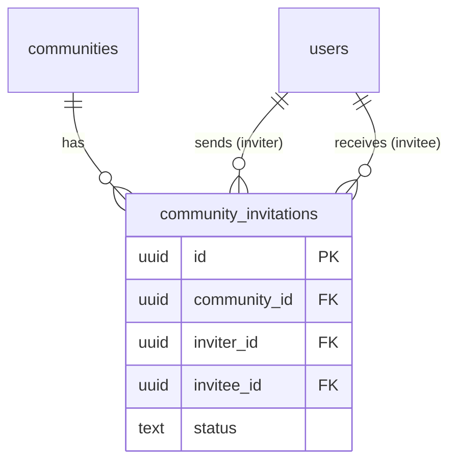

# community_invitations

## 1. What This Table Models

The `community_invitations` table represents **invitations** sent by community admins to users, asking them to join a community. This is distinct from join requests (which users initiate).

**Entity Type**: Event/Request Entity

This table exists because:
- Community admins can invite specific users
- Invitations have a status (pending, accepted, rejected)
- Track who invited whom
- Auto-join when invitation accepted

---

## 2. Column-by-Column Deep Dive

### `id` (UUID, PRIMARY KEY)
- **Meaning**: Unique identifier for the invitation
- **Default**: `uuid_generate_v4()`

### `community_id` (UUID, NOT NULL, FK)
- **Meaning**: The community the user is invited to
- **Cascade**: ON DELETE CASCADE

### `inviter_id` (UUID, NOT NULL, FK)
- **Meaning**: Admin/owner who sent the invitation
- **Cascade**: ON DELETE CASCADE
- **Constraint**: Must be admin/owner (enforced via RLS)

### `invitee_id` (UUID, NOT NULL, FK)
- **Meaning**: User being invited
- **Cascade**: ON DELETE CASCADE

### `status` (TEXT, NOT NULL, CHECK, DEFAULT 'pending')
- **Meaning**: Invitation status
- **Valid Values**: `pending`, `accepted`, `rejected`
- **Default**: `pending`

### `created_at` (TIMESTAMPTZ, NOT NULL, DEFAULT NOW())
- **Meaning**: When invitation was sent

### `responded_at` (TIMESTAMPTZ, NULL)
- **Meaning**: When invitee accepted or rejected
- **Note**: Set by trigger on status change

---

## 3. Constraints & Indexes

### Primary Key
```sql
PRIMARY KEY (id)
```

### Foreign Keys
```sql
REFERENCES public.communities(id) ON DELETE CASCADE
REFERENCES public.users(id) ON DELETE CASCADE  -- inviter_id
REFERENCES public.users(id) ON DELETE CASCADE  -- invitee_id
```

### Unique Constraint
```sql
UNIQUE(community_id, invitee_id)
```
- **Critical**: One invitation per user per community
- Prevents duplicate invitations

### Check Constraint
```sql
CHECK (status IN ('pending', 'accepted', 'rejected'))
```

### Indexes
```sql
CREATE INDEX community_invitations_community_id_idx ON public.community_invitations(community_id);
CREATE INDEX community_invitations_inviter_id_idx ON public.community_invitations(inviter_id);
CREATE INDEX community_invitations_invitee_id_idx ON public.community_invitations(invitee_id);
CREATE INDEX community_invitations_status_idx ON public.community_invitations(status);
```

### Triggers
```sql
-- Notify invitee
CREATE TRIGGER notify_user_of_invitation AFTER INSERT ON public.community_invitations
  FOR EACH ROW EXECUTE FUNCTION notify_user_of_community_invitation();

-- Auto-join on accept
CREATE TRIGGER auto_join_on_accept BEFORE UPDATE ON public.community_invitations
  FOR EACH ROW EXECUTE FUNCTION auto_join_on_invitation_accept();

-- Track invitation sent
CREATE TRIGGER track_invitation_sent_trigger AFTER INSERT ...

-- Track invitation response
CREATE TRIGGER track_invitation_response_trigger AFTER UPDATE ...

-- Track invitation cancelled
CREATE TRIGGER track_invitation_cancelled_trigger BEFORE DELETE ...
```

---

## 4. Relationships to Other Tables



### Relationships

| Related Table | Relationship | Notes |
|---------------|--------------|-------|
| `communities` | many:1 | Target community |
| `users` | many:1 | Inviter (admin/owner) |
| `users` | many:1 | Invitee |

### Implicit Relationship

When accepted, triggers create a `community_members` entry.

---

## 5. RLS (Row-Level Security) Rules

RLS is **ENABLED** on this table.

### Policies

| Policy | Operation | Rule |
|--------|-----------|------|
| "Users can view their invitations" | SELECT | Inviter, invitee, or community admin |
| "Community admins can send invitations" | INSERT | Admin + own ID as inviter |
| "Invitees can respond to invitations" | UPDATE | Invitee only |
| "Community admins can delete invitations" | DELETE | Inviter or community admin |

### INSERT Policy Detail

```sql
CREATE POLICY "Community admins can send invitations"
  ON public.community_invitations FOR INSERT
  WITH CHECK (
    auth.uid() = inviter_id
    AND is_community_admin(community_id, auth.uid())
  );
```

### UPDATE Policy Detail

```sql
CREATE POLICY "Invitees can respond to invitations"
  ON public.community_invitations FOR UPDATE
  USING (auth.uid() = invitee_id);
```

Only invitees can accept/reject - prevents admin from accepting on behalf.

👉 [Supabase Row Level Security](https://supabase.com/docs/guides/auth/row-level-security)

---

## 6. How This Table Is Used in the api-client

### Query Locations

```typescript
// communities.ts
.from('community_invitations')
.insert({
  community_id,
  inviter_id: user.id,
  invitee_id,
  status: 'pending'
})                                               // inviteUserToCommunity

.from('community_invitations')
.select(`*, inviter:users!inviter_id(...), invitee:users!invitee_id(...)`)
.eq('community_id', communityId)
.eq('status', 'pending')                         // getCommunityInvitations

.from('community_invitations')
.select(`*, community:communities!community_id(...), inviter:users!inviter_id(...)`)
.eq('invitee_id', userId)
.eq('status', 'pending')                         // getMyInvitations

.from('community_invitations')
.update({ status: 'accepted' })
.eq('id', invitationId)                          // acceptInvitation

.from('community_invitations')
.update({ status: 'rejected' })
.eq('id', invitationId)                          // rejectInvitation

.from('community_invitations')
.delete()
.eq('id', invitationId)                          // cancelInvitation
```

### Query Analysis

| Query | Optimal? | Notes |
|-------|----------|-------|
| Get pending for community | Yes | Indexes exist |
| Get my invitations | Yes | Index on invitee_id |
| Accept/reject | Yes | Simple update |
| Cancel | Yes | Simple delete |

---

## 7. Alternative Schema Designs

### Alternative A: Combined with Join Requests

Instead of `community_members.status = 'pending'` for join requests and separate `community_invitations`:

```sql
CREATE TABLE community_membership_requests (
  id UUID PRIMARY KEY,
  community_id UUID,
  user_id UUID,
  type TEXT CHECK (type IN ('join_request', 'invitation')),
  initiated_by UUID,  -- user for join_request, admin for invitation
  status TEXT,
  ...
);
```

**Pros**: Unified handling
**Cons**: Current separation is clearer

### Alternative B: Expiring Invitations

```sql
ALTER TABLE community_invitations ADD COLUMN expires_at TIMESTAMPTZ;

-- Default 30 days
DEFAULT NOW() + INTERVAL '30 days'
```

**Pros**: Auto-cleanup stale invitations
**Cons**: Need cron job or check on query

### Alternative C: Invitation Message

```sql
ALTER TABLE community_invitations ADD COLUMN message TEXT;
```

**Pros**: Personal touch
**Cons**: Low value, optional

**Recommendation**: Add expiration for cleaner data. Consider invitation message for UX.

---

## 8. Scalability Considerations

### Query Performance at Scale

| Operation | 100 Invitations | 10K Invitations |
|-----------|-----------------|-----------------|
| Get pending for user | Fast | Fast (index) |
| Get pending for community | Fast | Fast (index) |
| Accept/reject | Fast | Fast |

### Growth Concerns

Invitations are relatively bounded - only pending matter.

### Recommendations

1. **Clean up old invitations** - Delete rejected/accepted after 90 days
2. **Limit pending per user** - Prevent spam

---

## 9. Suggested Improvements

### Schema Changes

```sql
-- Add expiration
ALTER TABLE community_invitations ADD COLUMN expires_at TIMESTAMPTZ
  DEFAULT NOW() + INTERVAL '30 days';

-- Add invitation message
ALTER TABLE community_invitations ADD COLUMN message TEXT;

-- Prevent duplicate pending invitations
CREATE INDEX unique_pending_invitation
  ON community_invitations(community_id, invitee_id)
  WHERE status = 'pending';
```

### RLS Improvements

Current policies are well-designed.

### Pitfall Warnings

1. **No expiration** - Invitations persist forever
2. **Unique constraint includes rejected** - Can't re-invite after rejection
3. **Auto-join trigger complexity** - Creates member on accept
4. **No rate limiting** - Admin could spam invitations

---

## 10. Summary

### Strengths
- Clear invitation workflow
- Auto-join on acceptance via trigger
- Proper RLS for each operation
- Notification on invitation sent

### Weaknesses
- No expiration mechanism
- Can't re-invite after rejection
- No invitation message
- No rate limiting

### Key Development Reminders
- Only community admins/owners can send invitations
- Only invitee can accept/reject
- Trigger auto-creates membership on accept
- Trigger creates notification for invitee
- Unique constraint: one invitation per user per community (ever)
