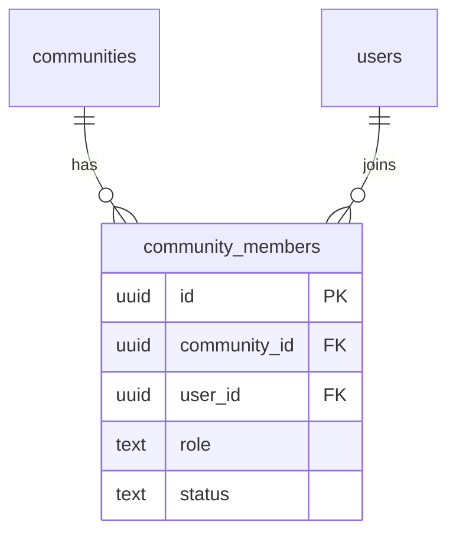

# community_members

## 1. What This Table Models

The `community_members` table is a **junction table** representing the many-to-many relationship between users and communities. It tracks membership, roles, and approval status.

**Entity Type**: Junction/Relationship Entity

This table exists because:
- Users can belong to multiple communities
- Communities have multiple members
- Members have roles (owner, admin, member)
- Membership can be pending or approved

---

## 2. Column-by-Column Deep Dive

### `id` (UUID, PRIMARY KEY)
- **Meaning**: Unique identifier for the membership record
- **Default**: `uuid_generate_v4()`
- **Note**: Could use composite PK instead

### `community_id` (UUID, NOT NULL, FK)
- **Meaning**: The community
- **Cascade**: ON DELETE CASCADE

### `user_id` (UUID, NOT NULL, FK)
- **Meaning**: The member user
- **Cascade**: ON DELETE CASCADE

### `role` (TEXT, NOT NULL, CHECK, DEFAULT 'member')
- **Meaning**: Member's role in the community
- **Valid Values**: `owner`, `admin`, `member`
- **Default**: `member`
- **Note**: Only ONE user should have `owner` role per community

### `status` (TEXT, NOT NULL, CHECK, DEFAULT 'pending')
- **Meaning**: Membership approval status
- **Valid Values**: `approved`, `pending`
- **Default**: `pending`
- **Note**: Pending members waiting for admin approval

### `joined_at` (TIMESTAMPTZ, NOT NULL, DEFAULT NOW())
- **Meaning**: When user joined/requested to join

---

## 3. Constraints & Indexes

### Primary Key
```sql
PRIMARY KEY (id)
```

### Foreign Keys
```sql
REFERENCES public.communities(id) ON DELETE CASCADE
REFERENCES public.users(id) ON DELETE CASCADE
```

### Unique Constraint
```sql
UNIQUE(community_id, user_id)
```
- **Critical**: One membership per user per community
- Prevents duplicate memberships

### Check Constraints
```sql
CHECK (role IN ('owner', 'admin', 'member'))
CHECK (status IN ('approved', 'pending'))
```

### Indexes
```sql
CREATE INDEX community_members_community_id_idx ON public.community_members(community_id);
CREATE INDEX community_members_user_id_idx ON public.community_members(user_id);
CREATE INDEX community_members_status_idx ON public.community_members(status);
```

### Triggers
```sql
-- Create activity when member joins (approved)
CREATE TRIGGER create_member_joined_activity_trigger
  AFTER INSERT OR UPDATE ON public.community_members
  FOR EACH ROW EXECUTE FUNCTION create_member_joined_activity();

-- Track join requests
CREATE TRIGGER track_join_request_created_trigger ...
CREATE TRIGGER track_join_request_decision_trigger ...
CREATE TRIGGER track_member_left_trigger ...
CREATE TRIGGER track_member_removed_trigger ...
CREATE TRIGGER track_member_role_changed_trigger ...
```

Multiple triggers track membership lifecycle for activity feed.

---

## 4. Relationships to Other Tables



### Relationships

| Related Table | Relationship | Notes |
|---------------|--------------|-------|
| `communities` | many:1 | Parent community |
| `users` | many:1 | Member user |

---

## 5. RLS (Row-Level Security) Rules

RLS is **ENABLED** on this table.

### Policies

| Policy | Operation | Rule |
|--------|-----------|------|
| "Members can view members in their communities" | SELECT | Own membership OR `is_community_member()` |
| "Users can join communities" | INSERT | `auth.uid() = user_id` |
| "Owners and admins can update members" | UPDATE | `is_community_admin()` |
| "Members can leave communities" | DELETE | Own record OR `is_community_admin()` |

### SELECT Policy Detail

```sql
CREATE POLICY "Members can view members in their communities"
  ON public.community_members FOR SELECT
  USING (
    user_id = auth.uid()  -- Can always see own membership
    OR is_community_member(community_id, auth.uid())  -- Or if member of community
  );
```

### Important: Helper Functions

Uses `is_community_member()` and `is_community_admin()` which are `SECURITY DEFINER` to avoid RLS recursion.

👉 [Supabase Row Level Security](https://supabase.com/docs/guides/auth/row-level-security)

---

## 6. How This Table Is Used in the api-client

### Query Locations

```typescript
// communities.ts
.from('community_members')
.select(`*, user:users!user_id (id, name, email, avatar_url)`)
.eq('community_id', communityId)
.eq('status', 'approved')                                      // getCommunityMembers

.from('community_members')
.select('*')
.eq('community_id', communityId)
.eq('status', 'pending')                                       // getPendingJoinRequests

.from('community_members')
.insert({ community_id, user_id, role: 'member', status })     // joinCommunity

.from('community_members')
.update({ status: 'approved' })
.eq('community_id', communityId)
.eq('user_id', userId)                                         // approveMember

.from('community_members')
.update({ role: newRole })
.eq('community_id', communityId)
.eq('user_id', userId)                                         // updateMemberRole

.from('community_members')
.delete()
.eq('community_id', communityId)
.eq('user_id', userId)                                         // removeMember
```

### Query Analysis

| Query | Optimal? | Notes |
|-------|----------|-------|
| Get members | Yes | Index on community_id |
| Get pending | Yes | Index on status |
| Check membership | Yes | Unique constraint |
| Update role | Yes | Simple update |

### Role-Based Operations

```typescript
// transferOwnership - Changes roles
async function transferOwnership(communityId, currentOwnerId, newOwnerId) {
  // Set new owner
  await updateMemberRole(communityId, newOwnerId, 'owner');
  // Demote old owner
  await updateMemberRole(communityId, currentOwnerId, 'admin');
}
```

---

## 7. Alternative Schema Designs

### Alternative A: Composite Primary Key

```sql
CREATE TABLE community_members (
  community_id UUID REFERENCES communities(id),
  user_id UUID REFERENCES users(id),
  role TEXT NOT NULL DEFAULT 'member',
  status TEXT NOT NULL DEFAULT 'pending',
  joined_at TIMESTAMPTZ DEFAULT NOW(),
  PRIMARY KEY (community_id, user_id)
);
```

**Pros**: No separate id, uniqueness built-in
**Cons**: Some ORMs prefer single id column

### Alternative B: Separate Roles Table

```sql
CREATE TABLE community_roles (
  id UUID PRIMARY KEY,
  name TEXT UNIQUE,  -- 'owner', 'admin', 'member'
  permissions JSONB   -- { can_invite: true, can_remove: true, ... }
);

ALTER TABLE community_members
  ADD COLUMN role_id UUID REFERENCES community_roles(id);
```

**Pros**: Flexible permissions, easy to add roles
**Cons**: More joins, overkill for 3 roles

### Alternative C: Membership History

```sql
CREATE TABLE membership_history (
  id UUID PRIMARY KEY,
  community_id UUID,
  user_id UUID,
  action TEXT,  -- 'joined', 'left', 'removed', 'role_changed'
  old_role TEXT,
  new_role TEXT,
  changed_by UUID,
  created_at TIMESTAMPTZ
);
```

**Pros**: Full audit trail
**Cons**: Triggers already log to community_activity

**Recommendation**: Current design is appropriate. Consider composite PK for new projects.

---

## 8. Scalability Considerations

### Query Performance at Scale

| Operation | 1K Members | 100K Members |
|-----------|------------|--------------|
| List members | Fast | Needs pagination |
| Check membership | Fast | Fast (unique index) |
| Count members | Fast | Fast |

### Recommendations

1. **Paginate member lists** for large communities
2. **Consider denormalizing member_count** on communities table
3. **Partial index** for admins: `WHERE role IN ('owner', 'admin')`

---

## 9. Suggested Improvements

### Schema Changes

```sql
-- Track who approved membership
ALTER TABLE community_members ADD COLUMN approved_by UUID REFERENCES users(id);
ALTER TABLE community_members ADD COLUMN approved_at TIMESTAMPTZ;

-- Track invite source
ALTER TABLE community_members ADD COLUMN invite_id UUID REFERENCES community_invitations(id);

-- Single owner constraint (complex - might need trigger)
-- Ensure only one owner per community
```

### RLS Improvements

Already well-designed with helper functions.

### Index Improvements

```sql
-- For admin lookups
CREATE INDEX community_members_admins_idx
  ON community_members(community_id, role)
  WHERE role IN ('owner', 'admin');
```

### Pitfall Warnings

1. **Multiple owners possible** - Schema doesn't enforce single owner
2. **Owner deletion risk** - If owner leaves, community has no owner
3. **Pending members** - Can see community but limited access
4. **Role vs status confusion** - Role is permission level, status is approval state

---

## 10. Summary

### Strengths
- Clean junction table design
- Unique constraint prevents duplicates
- Role and status well-separated
- Multiple triggers for activity tracking

### Weaknesses
- No single-owner enforcement
- No tracking of who approved
- Could use composite PK instead of separate id

### Key Development Reminders
- Always check both `role` AND `status` for permissions
- Use helper functions for RLS-safe membership checks
- Owner role tracked here, not in communities.created_by
- Trigger auto-creates membership when community created
- Paginate member lists for large communities
