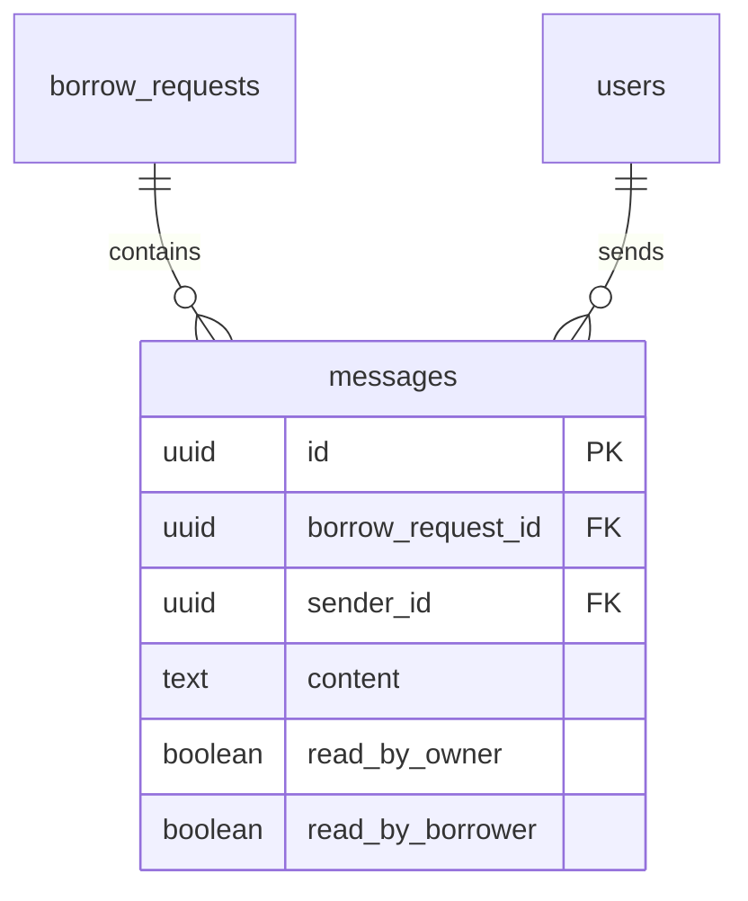

# messages

## 1. What This Table Models

The `messages` table represents **chat messages** exchanged between book owners and borrowers within the context of a borrow request. This enables communication about handover logistics, questions, etc.

**Entity Type**: Communication/Event Entity

This table exists because:
- Owner and borrower need to communicate
- Messages are scoped to a specific borrow request
- Each party has separate read status tracking
- Real-time updates via Supabase subscriptions

---

## 2. Column-by-Column Deep Dive

### `id` (UUID, PRIMARY KEY)
- **Meaning**: Unique identifier for the message
- **Default**: `uuid_generate_v4()`

### `borrow_request_id` (UUID, NOT NULL, FK)
- **Meaning**: The borrow request this message belongs to
- **Cascade**: ON DELETE CASCADE
- **Note**: Messages are always within a borrow request context

### `sender_id` (UUID, NOT NULL, FK)
- **Meaning**: User who sent the message
- **Cascade**: ON DELETE CASCADE
- **Constraint**: Must be either owner or borrower of the request

### `content` (TEXT, NOT NULL)
- **Meaning**: The message text
- **Nullable**: NOT NULL (empty messages not allowed)
- **Potential Issues**: No length limit

### `read_by_owner` (BOOLEAN, NOT NULL, DEFAULT FALSE)
- **Meaning**: Whether the book owner has read this message
- **Default**: FALSE
- **Note**: Used to calculate unread count for owner

### `read_by_borrower` (BOOLEAN, NOT NULL, DEFAULT FALSE)
- **Meaning**: Whether the borrower has read this message
- **Default**: FALSE
- **Note**: Used to calculate unread count for borrower

### `created_at` / `updated_at` (TIMESTAMPTZ)
- Standard timestamp fields

---

## 3. Constraints & Indexes

### Primary Key
```sql
PRIMARY KEY (id)
```

### Foreign Keys
```sql
REFERENCES public.borrow_requests(id) ON DELETE CASCADE
REFERENCES public.users(id) ON DELETE CASCADE
```

### Indexes
```sql
CREATE INDEX messages_request_id_idx ON public.messages(borrow_request_id);
CREATE INDEX messages_sender_id_idx ON public.messages(sender_id);
CREATE INDEX messages_created_at_idx ON public.messages(created_at);

-- Partial indexes for unread queries
CREATE INDEX messages_unread_owner_idx
  ON public.messages(borrow_request_id, read_by_owner)
  WHERE read_by_owner = FALSE;

CREATE INDEX messages_unread_borrower_idx
  ON public.messages(borrow_request_id, read_by_borrower)
  WHERE read_by_borrower = FALSE;
```

| Index | Type | Purpose |
|-------|------|---------|
| `messages_request_id_idx` | BTREE | Get messages for a request |
| `messages_sender_id_idx` | BTREE | Get messages by sender |
| `messages_created_at_idx` | BTREE | Sort by time |
| `messages_unread_owner_idx` | Partial | Efficient unread count for owner |
| `messages_unread_borrower_idx` | Partial | Efficient unread count for borrower |

### Triggers
```sql
-- Update timestamp
CREATE TRIGGER update_messages_updated_at BEFORE UPDATE ON public.messages
  FOR EACH ROW EXECUTE FUNCTION update_updated_at_column();

-- Update last_message_* on borrow_requests
CREATE TRIGGER message_update_last_message AFTER INSERT ON public.messages
  FOR EACH ROW EXECUTE FUNCTION update_last_message();
```

The `update_last_message` trigger:
- Sets `borrow_requests.last_message_at` to message timestamp
- Sets `borrow_requests.last_message_content` to first 100 chars

---

## 4. Relationships to Other Tables



### Relationships

| Related Table | Relationship | FK Column |
|---------------|--------------|-----------|
| `borrow_requests` | many:1 | `borrow_request_id` |
| `users` | many:1 | `sender_id` |

### Implicit Constraint

A message's `sender_id` should be either:
- `borrow_request.owner_id`, OR
- `borrow_request.borrower_id`

This is NOT enforced in the schema - only via RLS policy.

---

## 5. RLS (Row-Level Security) Rules

RLS is **ENABLED** on this table.

### Policies

| Policy | Operation | Rule |
|--------|-----------|------|
| "Users can view messages for their requests" | SELECT | User is owner or borrower of request |
| "Users can send messages for their requests" | INSERT | sender_id = auth.uid() AND user is owner/borrower |
| "Admins can view all messages" | SELECT | Admin subquery |

### SELECT Policy Detail

```sql
CREATE POLICY "Users can view messages for their requests"
  ON public.messages FOR SELECT
  USING (
    EXISTS (
      SELECT 1 FROM public.borrow_requests br
      WHERE br.id = borrow_request_id
      AND (br.borrower_id = auth.uid() OR br.owner_id = auth.uid())
    )
  );
```

### INSERT Policy Detail

```sql
CREATE POLICY "Users can send messages for their requests"
  ON public.messages FOR INSERT
  WITH CHECK (
    auth.uid() = sender_id
    AND EXISTS (
      SELECT 1 FROM public.borrow_requests br
      WHERE br.id = borrow_request_id
      AND (br.borrower_id = auth.uid() OR br.owner_id = auth.uid())
    )
  );
```

### Missing Policies

- **No UPDATE policy** - Messages can't be edited
- **No DELETE policy** - Messages can't be deleted by users

👉 [Supabase Row Level Security](https://supabase.com/docs/guides/auth/row-level-security)

---

## 6. How This Table Is Used in the api-client

### Query Locations

```typescript
// messages.ts
.from('messages')
.select(`*, sender:users!sender_id (id, name, email, avatar_url)`)
.eq('borrow_request_id', requestId)
.order('created_at', { ascending: true })                    // getMessagesByRequest

.from('messages').insert({ borrow_request_id, sender_id, content })  // sendMessage

.from('messages')
.update({ read_by_owner: true })  // or read_by_borrower
.eq('borrow_request_id', requestId)
.neq('sender_id', user.id)                                   // markMessagesAsRead

.from('messages')
.select('*', { count: 'exact', head: true })
.eq('borrow_request_id', requestId)
.eq('read_by_owner', false)
.neq('sender_id', user.id)                                   // getUnreadMessageCount

// Realtime subscription
.channel(`messages:${requestId}`)
.on('postgres_changes', {
  event: 'INSERT',
  table: 'messages',
  filter: `borrow_request_id=eq.${requestId}`
}, ...)                                                       // subscribeToMessages
```

### Query Analysis

| Query | Optimal? | Notes |
|-------|----------|-------|
| Get messages for request | Yes | Uses index + embedded resource |
| Send message | Yes | Simple insert |
| Mark as read | Yes | Bulk update |
| Unread count | Yes | Uses partial index |
| Realtime subscribe | Good | Filtered by request_id |

### Efficient Pattern: Dual Read Flags

The dual boolean approach (`read_by_owner`, `read_by_borrower`) is efficient because:
- Exactly 2 participants (always)
- No need for junction table
- Partial indexes make queries fast

---

## 7. Alternative Schema Designs

### Alternative A: Generic Read Receipts Table

```sql
CREATE TABLE message_reads (
  message_id UUID REFERENCES messages(id),
  user_id UUID REFERENCES users(id),
  read_at TIMESTAMPTZ DEFAULT NOW(),
  PRIMARY KEY (message_id, user_id)
);
```

**Pros**: Scales to N participants, tracks read time
**Cons**: More queries, overkill for 2-party chat

### Alternative B: Array of Read User IDs

```sql
ALTER TABLE messages ADD COLUMN read_by UUID[] DEFAULT '{}';

-- Check if read
WHERE user_id = ANY(read_by)
```

**Pros**: Single column, flexible
**Cons**: Array operations slower, can't use standard indexes

### Alternative C: Message Threads

```sql
ALTER TABLE messages ADD COLUMN reply_to_id UUID REFERENCES messages(id);
```

**Pros**: Enable threaded conversations
**Cons**: More complex UI, likely overkill

**Recommendation**: Current design is optimal for 2-party chat. If group chat needed, switch to message_reads junction table.

---

## 8. Scalability Considerations

### Query Performance at Scale

| Operation | 100 Messages | 10K Messages |
|-----------|--------------|--------------|
| Get messages | Fast | Needs pagination |
| Unread count | Fast | Fast (partial index) |
| Mark all read | Moderate | Moderate |

### Growth Concerns

- Active borrow: 20+ messages
- Old requests may accumulate thousands of messages

### Recommendations

1. **Paginate message loading** - Load last 50, then scroll to load more
2. **Archive old chats** - Move messages from completed requests
3. **Lazy load sender info** - Don't embed if showing many messages

---

## 9. Suggested Improvements

### Schema Changes

```sql
-- Add message type (for system messages)
ALTER TABLE messages ADD COLUMN type TEXT DEFAULT 'user'
  CHECK (type IN ('user', 'system'));

-- Add attachment support
ALTER TABLE messages ADD COLUMN attachments JSONB DEFAULT '[]';

-- Add edited tracking
ALTER TABLE messages ADD COLUMN edited_at TIMESTAMPTZ;

-- Content length limit
ALTER TABLE messages ADD CONSTRAINT content_length
  CHECK (char_length(content) <= 5000);
```

### RLS Improvements

```sql
-- Allow message editing (within time limit)
CREATE POLICY "Users can edit own recent messages"
  ON messages FOR UPDATE
  USING (
    sender_id = auth.uid()
    AND created_at > NOW() - INTERVAL '5 minutes'
  );
```

### Index Improvements

```sql
-- Composite for common query pattern
CREATE INDEX messages_request_created_idx
  ON messages(borrow_request_id, created_at DESC);
```

### Pitfall Warnings

1. **No content length limit** - Could store very large messages
2. **No edit/delete** - Users can't fix typos
3. **Trigger dependency** - If trigger fails, last_message_* stale
4. **Sender validation** - Only enforced via RLS, not schema

---

## 10. Summary

### Strengths
- Efficient dual read flags for 2-party chat
- Partial indexes for unread queries
- Trigger syncs last_message to borrow_requests
- Realtime subscription properly filtered

### Weaknesses
- No content length limit
- Can't edit or delete messages
- Sender validation only via RLS
- No support for attachments

### Key Development Reminders
- Messages are scoped to borrow_requests - no standalone chat
- Read status is per-party (owner vs borrower)
- Trigger maintains denormalized last_message_* on borrow_requests
- Paginate message loading for performance
- Use `ascending: true` to show oldest first (chat order)
