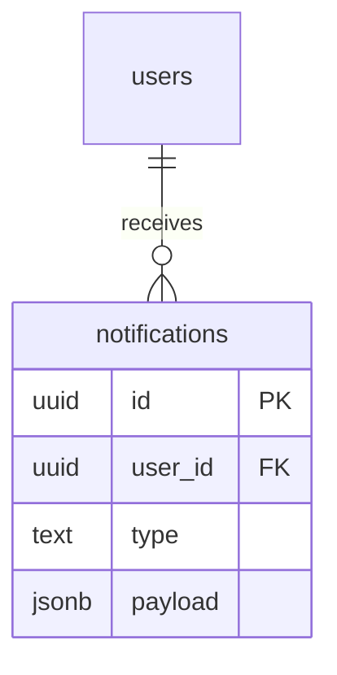

# notifications

## 1. What This Table Models

The `notifications` table represents **user notifications** - alerts about events relevant to a user such as borrow requests, approvals, messages, and community activity.

**Entity Type**: Event/Alert Entity

This table exists because:
- Users need to be alerted about relevant events
- Notifications have read/unread state
- Different notification types have different payloads
- Real-time updates via Supabase subscriptions

---

## 2. Column-by-Column Deep Dive

### `id` (UUID, PRIMARY KEY)
- **Meaning**: Unique identifier for the notification
- **Default**: `uuid_generate_v4()`

### `user_id` (UUID, NOT NULL, FK)
- **Meaning**: User who should receive this notification
- **Cascade**: ON DELETE CASCADE
- **Note**: Notifications are FOR a user, not FROM a user

### `type` (TEXT, NOT NULL, CHECK)
- **Meaning**: Category of notification
- **Valid Values**: `borrow_request`, `request_approved`, `request_denied`, `book_returned`, `due_soon`, `overdue`, `new_message`, `community_join_request`, `community_invitation`, `announcement`, `alert`, `info`
- **Type Rationale**: TEXT with CHECK (expandable pseudo-enum)
- **Potential Issues**: Type list has grown - consider proper ENUM

### `title` (TEXT, NOT NULL)
- **Meaning**: Notification headline
- **Example**: "New Borrow Request", "Request Approved"

### `message` (TEXT, NOT NULL)
- **Meaning**: Notification body text
- **Example**: "John wants to borrow your book"

### `payload` (JSONB, NULL)
- **Meaning**: Structured data specific to notification type
- **Examples**:
  - `{ "book_id": "...", "request_id": "..." }`
  - `{ "community_id": "...", "inviter_id": "..." }`
- **Type Rationale**: JSONB for flexible, queryable structured data

👉 [Supabase JSON Columns](https://supabase.com/docs/guides/database/json)

### `read` (BOOLEAN, NOT NULL, DEFAULT FALSE)
- **Meaning**: Whether user has seen/acknowledged the notification
- **Default**: FALSE (new notifications are unread)

### `created_at` / `updated_at` (TIMESTAMPTZ)
- Standard timestamp fields

---

## 3. Constraints & Indexes

### Primary Key
```sql
PRIMARY KEY (id)
```

### Foreign Key
```sql
REFERENCES public.users(id) ON DELETE CASCADE
```

### Check Constraint
```sql
CHECK (type IN ('borrow_request', 'request_approved', 'request_denied',
                'book_returned', 'due_soon', 'overdue', 'new_message',
                'community_join_request', 'community_invitation',
                'announcement', 'alert', 'info'))
```

### Indexes
```sql
CREATE INDEX notifications_user_id_idx ON public.notifications(user_id);
CREATE INDEX notifications_read_idx ON public.notifications(read);
CREATE INDEX notifications_created_at_idx ON public.notifications(created_at DESC);
```

| Index | Purpose |
|-------|---------|
| `notifications_user_id_idx` | Get user's notifications |
| `notifications_read_idx` | Filter unread notifications |
| `notifications_created_at_idx` | Sort by newest first |

**Missing Index**: Composite `(user_id, read)` would be more efficient for "get unread for user" query.

### Triggers
```sql
CREATE TRIGGER update_notifications_updated_at BEFORE UPDATE ON public.notifications
  FOR EACH ROW EXECUTE FUNCTION update_updated_at_column();
```

---

## 4. Relationships to Other Tables



### Relationships

| Related Table | Relationship | Notes |
|---------------|--------------|-------|
| `users` | many:1 | Notification recipient |

### Soft References (in payload)

The `payload` JSONB may contain references to:
- `book_id` → books.id
- `request_id` → borrow_requests.id
- `community_id` → communities.id

These are NOT enforced foreign keys - if referenced entity is deleted, payload becomes stale.

---

## 5. RLS (Row-Level Security) Rules

RLS is **ENABLED** on this table.

### Policies

| Policy | Operation | Rule |
|--------|-----------|------|
| "Users can view own notifications" | SELECT | `auth.uid() = user_id` |
| "Authenticated users can create notifications" | INSERT | `WITH CHECK (true)` |
| "Users can update own notifications" | UPDATE | `auth.uid() = user_id` |
| "Users can delete own notifications" | DELETE | `auth.uid() = user_id` |
| "Admins can view all notifications" | SELECT | Admin subquery |
| "Admins can create notifications" | INSERT | Admin + true check |

### Critical Issue: INSERT Policy

```sql
CREATE POLICY "Authenticated users can create notifications"
  ON public.notifications FOR INSERT
  WITH CHECK (true);
```

This allows ANY authenticated user to create notifications for ANY user. This is **intentionally permissive** because:
- User A needs to notify User B about a borrow request
- Triggers create notifications for other users

However, the api-client uses an RPC function instead:
```typescript
await supabase.rpc('create_notification_secure', {...})
```

👉 [Supabase Security Definer Functions](https://supabase.com/docs/guides/database/functions#security-definer-vs-invoker)

---

## 6. How This Table Is Used in the api-client

### Query Locations

```typescript
// notifications.ts
.from('notifications').select('*').eq('user_id', user.id)              // getNotifications
.from('notifications').select('*', { count: 'exact', head: true })     // getUnreadCount
.from('notifications').update({ read: true }).eq('id', id)             // markNotificationAsRead
.from('notifications').update({ read: true }).eq('user_id', user.id)   // markAllAsRead
.from('notifications').delete().eq('id', id)                           // deleteNotification

// RPC usage for cross-user creation
.rpc('create_notification_secure', { p_user_id, p_type, ... })

// Realtime subscription
.channel('notifications')
.on('postgres_changes', { event: 'INSERT', table: 'notifications' }, ...)
```

### Query Analysis

| Query | Optimal? | Notes |
|-------|----------|-------|
| Get user's notifications | Moderate | Could use composite index |
| Count unread | Good | Uses `{ head: true }` |
| Mark as read | Good | Simple update |
| Real-time subscribe | Issue | No user_id filter! |

### Realtime Security Issue

Current subscription:
```typescript
.on('postgres_changes', { event: 'INSERT', table: 'notifications' }, ...)
```

This subscribes to ALL notification inserts, not filtered by user. Should add filter:
```typescript
.on('postgres_changes', {
  event: 'INSERT',
  table: 'notifications',
  filter: `user_id=eq.${userId}`  // Add this!
}, ...)
```

👉 [Supabase Realtime Filters](https://supabase.com/docs/guides/realtime/postgres-changes#filters)

---

## 7. Alternative Schema Designs

### Alternative A: Enum for Type

```sql
CREATE TYPE notification_type AS ENUM (
  'borrow_request', 'request_approved', 'request_denied',
  'book_returned', 'due_soon', 'overdue', 'new_message',
  'community_join_request', 'community_invitation',
  'announcement', 'alert', 'info'
);

ALTER TABLE notifications ALTER COLUMN type TYPE notification_type;
```

**Pros**: Type safety, IDE autocomplete
**Cons**: Migration needed to add new types

👉 [Supabase Enums](https://supabase.com/docs/guides/database/enums)

### Alternative B: Separate Tables per Type

```sql
CREATE TABLE borrow_notifications (
  id UUID PRIMARY KEY,
  user_id UUID REFERENCES users(id),
  borrow_request_id UUID REFERENCES borrow_requests(id),
  ...
);

CREATE TABLE community_notifications (...);
```

**Pros**: Type-specific FKs, cleaner schema
**Cons**: More tables, scattered queries

### Alternative C: TTL (Time-to-Live)

```sql
ALTER TABLE notifications ADD COLUMN expires_at TIMESTAMPTZ;

-- Cron job or trigger to delete expired
DELETE FROM notifications WHERE expires_at < NOW();
```

**Pros**: Automatic cleanup
**Cons**: Need scheduled job

**Recommendation**: Use proper ENUM and add composite index. Consider TTL for old notifications.

---

## 8. Scalability Considerations

### Query Performance at Scale

| Operation | 100 Notifs/User | 10K Notifs/User |
|-----------|-----------------|-----------------|
| Get unread | Fast | Moderate |
| Count unread | Fast | Fast |
| Mark all read | Moderate | Slow |

### Growth Concerns

Notifications grow unbounded:
- Active user: 10+ notifications/day
- 1000 users × 365 days × 10 = 3.65M notifications/year

### Recommendations

1. **Add TTL** - Delete notifications older than 90 days
2. **Composite index**: `CREATE INDEX ON notifications(user_id, read, created_at DESC)`
3. **Paginate** - Don't load all notifications
4. **Archive** - Move old read notifications to history table

---

## 9. Suggested Improvements

### Schema Changes

```sql
-- Composite index for common query
CREATE INDEX notifications_user_unread_idx ON notifications(user_id, read, created_at DESC)
  WHERE read = FALSE;

-- Add TTL column
ALTER TABLE notifications ADD COLUMN expires_at TIMESTAMPTZ DEFAULT NOW() + INTERVAL '90 days';

-- Add action URL
ALTER TABLE notifications ADD COLUMN action_url TEXT;

-- Consider enum
CREATE TYPE notification_type AS ENUM (...);
```

### RLS Improvements

```sql
-- Restrict who can create notifications (use RPC instead)
DROP POLICY "Authenticated users can create notifications" ON notifications;

-- Only allow RPC-based creation
-- (keep create_notification_secure function)
```

### Realtime Fix

Filter subscriptions by user:
```typescript
.on('postgres_changes', {
  event: 'INSERT',
  table: 'notifications',
  filter: `user_id=eq.${userId}`
}, ...)
```

### Pitfall Warnings

1. **Unbounded growth** - No TTL, notifications accumulate forever
2. **Realtime security** - Subscription doesn't filter by user
3. **Stale payload references** - If book/request deleted, payload links break
4. **Permissive INSERT policy** - Any user can create notifications for anyone

---

## 10. Summary

### Strengths
- Flexible payload via JSONB
- Multiple notification types supported
- Triggers create notifications automatically
- Unread count is efficient

### Weaknesses
- No TTL/cleanup mechanism
- Realtime subscription not filtered
- INSERT policy too permissive
- No composite index for user+read queries

### Key Development Reminders
- Use RPC function for creating cross-user notifications
- Filter realtime subscriptions by user_id
- Paginate notification lists
- Consider adding cleanup job for old notifications
- Payload references are soft - may become stale
