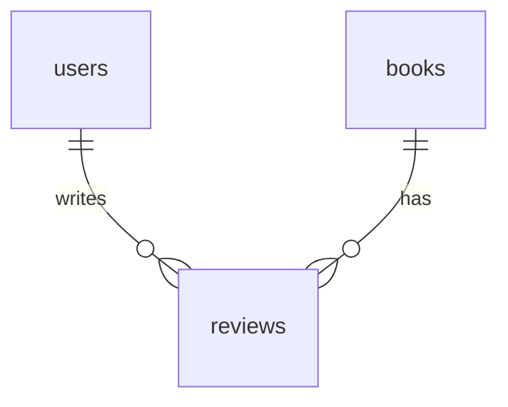

# reviews

## 1. What This Table Models

The `reviews` table represents **user reviews and ratings** for books. Each review is a user's assessment of a book they have (presumably) borrowed or own.

**Entity Type**: User-Generated Content Entity

This table exists because:
- Users can rate books (1-5 stars)
- Users can write textual reviews
- Reviews help other users decide what to borrow
- One review per user per book (no spam)

---

## 2. Column-by-Column Deep Dive

### `id` (UUID, PRIMARY KEY)
- **Meaning**: Unique identifier for the review
- **Type Rationale**: UUID for global uniqueness
- **Default**: `uuid_generate_v4()`
- **Potential Issues**: None

### `book_id` (UUID, NOT NULL, FK)
- **Meaning**: The book being reviewed
- **Cascade**: ON DELETE CASCADE
- **Hidden Assumptions**: Book exists and user has some relationship to it
- **Potential Issues**: No enforcement that reviewer actually borrowed the book

### `user_id` (UUID, NOT NULL, FK)
- **Meaning**: The user writing the review
- **Cascade**: ON DELETE CASCADE
- **Hidden Assumptions**: User is authenticated
- **Potential Issues**: None

### `rating` (INTEGER, NOT NULL, CHECK)
- **Meaning**: Star rating (1-5)
- **Type Rationale**: INTEGER for numeric operations (averaging)
- **Check Constraint**: `rating >= 1 AND rating <= 5`
- **Hidden Assumptions**: Higher is better
- **Potential Issues**: None - constraint enforces valid range

### `comment` (TEXT, NULL)
- **Meaning**: Review text/description
- **Type Rationale**: TEXT for flexible length
- **Nullable**: NULL (rating-only reviews allowed)
- **Hidden Assumptions**: None
- **Potential Issues**: No length limit, no profanity filter

### `created_at` / `updated_at` (TIMESTAMPTZ)
- Standard timestamp fields

---

## 3. Constraints & Indexes

### Primary Key
```sql
PRIMARY KEY (id)
```

### Foreign Keys
```sql
REFERENCES public.books(id) ON DELETE CASCADE
REFERENCES public.users(id) ON DELETE CASCADE
```

### Unique Constraint
```sql
UNIQUE(book_id, user_id)
```
- **Critical**: Ensures one review per user per book
- Prevents spam/duplicate reviews

### Check Constraint
```sql
CHECK (rating >= 1 AND rating <= 5)
```
- Enforces valid rating range

### Indexes
```sql
CREATE INDEX reviews_book_id_idx ON public.reviews(book_id);
CREATE INDEX reviews_user_id_idx ON public.reviews(user_id);
CREATE INDEX reviews_rating_idx ON public.reviews(rating);
```

| Index | Purpose |
|-------|---------|
| `reviews_book_id_idx` | Get all reviews for a book |
| `reviews_user_id_idx` | Get all reviews by a user |
| `reviews_rating_idx` | Filter by rating (e.g., 5-star reviews) |

### Triggers
```sql
CREATE TRIGGER update_reviews_updated_at BEFORE UPDATE ON public.reviews
  FOR EACH ROW EXECUTE FUNCTION update_updated_at_column();
```

---

## 4. Relationships to Other Tables



### Relationships

| Related Table | Relationship | FK Column | Notes |
|---------------|--------------|-----------|-------|
| `books` | many:1 | `book_id` | Book being reviewed |
| `users` | many:1 | `user_id` | Author of review |

### Missing Relationship

There's NO link to `borrow_requests`. This means:
- A user can review a book they never borrowed
- No verification that reviewer actually read the book

---

## 5. RLS (Row-Level Security) Rules

RLS is **ENABLED** on this table.

### Policies

| Policy | Operation | Rule |
|--------|-----------|------|
| "Anyone can view reviews" | SELECT | `USING (true)` |
| "Users can create reviews" | INSERT | `WITH CHECK (auth.uid() = user_id)` |
| "Users can update own reviews" | UPDATE | `USING (auth.uid() = user_id)` |
| "Users can delete own reviews" | DELETE | `USING (auth.uid() = user_id)` |
| "Admins can view all reviews" | SELECT | Admin subquery |

### Edge Cases

1. **Public reviews** - Anyone can see all reviews
2. **Self-review possible** - No check preventing owner from reviewing own book
3. **Admin can view but not moderate** - No admin delete policy

👉 [Supabase Row Level Security](https://supabase.com/docs/guides/auth/row-level-security)

---

## 6. How This Table Is Used in the api-client

### Query Locations

```typescript
// reviews.ts
.from('reviews').select('*').order('created_at', { ascending: false })  // getReviews
.from('reviews').select('*').eq('id', id).single()                      // getReview
.from('reviews').insert({...})                                           // createReview
.from('reviews').update({...}).eq('id', id)                             // updateReview
.from('reviews').delete().eq('id', id)                                  // deleteReview
.from('reviews').select('rating').eq('book_id', bookId)                 // getBookAverageRating
.from('reviews').select('id').eq('book_id', bookId).eq('user_id', userId) // hasUserReviewedBook
```

### Query Analysis

| Query | Optimal? | Notes |
|-------|----------|-------|
| Get by book_id | Yes | Index exists |
| Get by user_id | Yes | Index exists |
| Calculate average | Moderate | Fetches all ratings, computes client-side |
| Check if reviewed | Yes | Uses unique constraint |

### Performance Note

`getBookAverageRating` fetches ALL ratings for a book and computes the average in JavaScript:
```typescript
const sum = data.reduce((acc, review) => acc + review.rating, 0);
return sum / data.length;
```

This is fine for small numbers but inefficient at scale.

---

## 7. Alternative Schema Designs

### Alternative A: Denormalize Average on Books

```sql
ALTER TABLE books ADD COLUMN average_rating NUMERIC(3,2);
ALTER TABLE books ADD COLUMN review_count INTEGER DEFAULT 0;

-- Trigger to update on review insert/update/delete
CREATE FUNCTION update_book_rating() RETURNS TRIGGER AS $$
BEGIN
  UPDATE books SET
    average_rating = (SELECT AVG(rating) FROM reviews WHERE book_id = NEW.book_id),
    review_count = (SELECT COUNT(*) FROM reviews WHERE book_id = NEW.book_id)
  WHERE id = NEW.book_id;
  RETURN NEW;
END;
$$ LANGUAGE plpgsql;
```

**Pros**: O(1) average lookup
**Cons**: Trigger complexity, slight delay

### Alternative B: Link to Borrow Request

```sql
ALTER TABLE reviews ADD COLUMN borrow_request_id UUID REFERENCES borrow_requests(id);
```

**Pros**: Verify reviewer actually borrowed the book
**Cons**: Owners can't review their own books (may be desired)

### Alternative C: Require Text for Low Ratings

```sql
ALTER TABLE reviews ADD CONSTRAINT require_comment_for_low_rating
  CHECK (rating >= 3 OR comment IS NOT NULL);
```

**Pros**: Forces explanation for negative reviews
**Cons**: May discourage honest low ratings

**Recommendation**: Add denormalized average on books table for performance. Consider linking to borrow_request for verification.

---

## 8. Scalability Considerations

### Query Performance at Scale

| Operation | 100 Reviews/Book | 1000 Reviews/Book |
|-----------|------------------|-------------------|
| Get reviews for book | Fast | Needs pagination |
| Calculate average | Fast | Slow (client-side) |
| Check if reviewed | Fast | Fast (unique constraint) |

### Recommendations

1. **Denormalize average rating** on books table
2. **Paginate review lists** - Don't load all reviews at once
3. **Consider caching** popular book ratings

### Storage Growth

- ~200 bytes per review (without long comments)
- 100K reviews ≈ 20MB

---

## 9. Suggested Improvements

### Schema Changes

```sql
-- Add helpful vote tracking
ALTER TABLE reviews ADD COLUMN helpful_count INTEGER DEFAULT 0;

-- Add verified purchase indicator
ALTER TABLE reviews ADD COLUMN verified_borrower BOOLEAN DEFAULT FALSE;

-- Link to borrow request (optional)
ALTER TABLE reviews ADD COLUMN borrow_request_id UUID REFERENCES borrow_requests(id);

-- Add length constraint
ALTER TABLE reviews ADD CONSTRAINT comment_length CHECK (
  comment IS NULL OR char_length(comment) <= 5000
);
```

### RLS Improvements

```sql
-- Prevent self-reviews (owner reviewing own book)
DROP POLICY "Users can create reviews" ON reviews;
CREATE POLICY "Users can create reviews for others' books"
  ON reviews FOR INSERT
  WITH CHECK (
    auth.uid() = user_id
    AND NOT EXISTS (
      SELECT 1 FROM books WHERE id = book_id AND owner_id = auth.uid()
    )
  );

-- Admin moderation policy
CREATE POLICY "Admins can delete any review"
  ON reviews FOR DELETE
  USING (
    EXISTS (SELECT 1 FROM users WHERE id = auth.uid() AND is_admin = TRUE)
  );
```

### Performance Improvements

```sql
-- Denormalize average on books (add trigger)
ALTER TABLE books ADD COLUMN average_rating NUMERIC(3,2);
ALTER TABLE books ADD COLUMN review_count INTEGER DEFAULT 0;

-- Or use database function for average
CREATE FUNCTION get_book_average_rating(p_book_id UUID)
RETURNS NUMERIC AS $$
  SELECT COALESCE(AVG(rating)::NUMERIC(3,2), 0)
  FROM reviews WHERE book_id = p_book_id;
$$ LANGUAGE SQL STABLE;
```

### Pitfall Warnings

1. **No borrower verification** - Anyone can review any book
2. **Self-review allowed** - Owner can review own book
3. **Client-side average** - Inefficient for popular books
4. **No comment moderation** - Could contain inappropriate content

---

## 10. Summary

### Strengths
- Simple, clean schema
- Unique constraint prevents duplicate reviews
- Check constraint enforces valid rating range
- All common query patterns indexed

### Weaknesses
- No link to borrow_request (unverified reviews)
- Average rating computed client-side (inefficient)
- Self-review allowed
- No comment length limit or moderation

### Key Development Reminders
- Use unique constraint to prevent duplicate reviews (don't check client-side)
- Consider denormalizing average rating for performance
- Paginate review lists for books with many reviews
- Consider adding `borrow_request_id` for verified reviews
