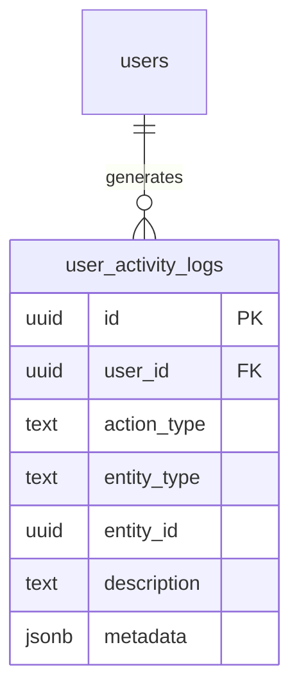

# user_activity_logs

## 1. What This Table Models

The `user_activity_logs` table represents a **global audit log** of user actions across the entire platform - not limited to communities. It tracks book additions, borrow requests, and other user activities.

**Entity Type**: Audit/Event Log Entity

This table exists because:
- Track user actions for analytics
- Provide activity history to users
- Enable admin monitoring of user behavior
- Support platform-wide activity feeds

---

## 2. Column-by-Column Deep Dive

### `id` (UUID, PRIMARY KEY)
- **Meaning**: Unique identifier for the activity entry
- **Default**: `gen_random_uuid()` (PostgreSQL native)
- **Note**: Uses `gen_random_uuid()` not `uuid_generate_v4()` (both work)

### `user_id` (UUID, NOT NULL, FK)
- **Meaning**: User who performed the action
- **Cascade**: ON DELETE CASCADE

### `action_type` (TEXT, NOT NULL)
- **Meaning**: Category of action performed
- **Values**: `book_added`, `borrow_request_created`, `borrow_request_approved`, `borrow_request_denied`, `book_borrowed`, `book_returned`, etc.
- **Note**: Free-form TEXT, not CHECK constraint

### `entity_type` (TEXT, NULL)
- **Meaning**: Type of entity affected
- **Values**: `book`, `borrow_request`, `review`, etc.
- **Note**: For polymorphic reference

### `entity_id` (UUID, NULL)
- **Meaning**: ID of affected entity
- **Note**: Soft reference (no FK constraint)

### `description` (TEXT, NOT NULL)
- **Meaning**: Human-readable description of action
- **Examples**: "Added book: The Great Gatsby", "Requested to borrow a book"

### `metadata` (JSONB, NULL)
- **Meaning**: Additional structured data
- **Note**: Varies by action_type

### `created_at` (TIMESTAMPTZ, DEFAULT NOW())
- **Meaning**: When action occurred

---

## 3. Constraints & Indexes

### Primary Key
```sql
PRIMARY KEY (id)
```

### Foreign Key
```sql
REFERENCES users(id) ON DELETE CASCADE
```

### No Check Constraints

`action_type` and `entity_type` are free-form TEXT - no validation.

### Indexes
```sql
CREATE INDEX idx_user_activity_logs_user_id ON user_activity_logs(user_id);
CREATE INDEX idx_user_activity_logs_created_at ON user_activity_logs(created_at DESC);
CREATE INDEX idx_user_activity_logs_action_type ON user_activity_logs(action_type);
```

### Triggers
```sql
-- Log book additions
CREATE TRIGGER trigger_log_book_addition AFTER INSERT ON books
  FOR EACH ROW EXECUTE FUNCTION log_book_addition();

-- Log borrow request actions
CREATE TRIGGER trigger_log_borrow_request_action AFTER INSERT OR UPDATE ON borrow_requests
  FOR EACH ROW EXECUTE FUNCTION log_borrow_request_action();
```

---

## 4. Relationships to Other Tables



### Relationships

| Related Table | Relationship | Notes |
|---------------|--------------|-------|
| `users` | many:1 | Acting user |

### Soft References

`entity_id` references various tables based on `entity_type`:
- `book` → books.id
- `borrow_request` → borrow_requests.id
- `review` → reviews.id

These are NOT enforced foreign keys.

---

## 5. RLS (Row-Level Security) Rules

RLS is **ENABLED** on this table.

### Policies

| Policy | Operation | Rule |
|--------|-----------|------|
| "Admins can read all activity logs" | SELECT | User is admin |
| "Users can read own activity logs" | SELECT | `user_id = auth.uid()` |

### Policy Details

```sql
CREATE POLICY "Admins can read all activity logs"
  ON user_activity_logs FOR SELECT
  USING (
    EXISTS (
      SELECT 1 FROM users
      WHERE users.id = auth.uid()
      AND users.is_admin = true
    )
  );

CREATE POLICY "Users can read own activity logs"
  ON user_activity_logs FOR SELECT
  USING (user_id = auth.uid());
```

### No INSERT/UPDATE/DELETE Policies

Activity logs are created by triggers, not direct user inserts. The table is effectively append-only from user perspective.

👉 [Supabase Row Level Security](https://supabase.com/docs/guides/auth/row-level-security)

---

## 6. How This Table Is Used in the api-client

### Query Locations

```typescript
// admin.ts
.from('user_activity_logs')
.select('*')
.order('created_at', { ascending: false })
.limit(limit)                                    // getRecentActivity

.from('user_activity_logs')
.select('*')
.eq('user_id', userId)
.order('created_at', { ascending: false })
.limit(limit)                                    // getUserActivityHistory
```

### Query Analysis

| Query | Optimal? | Notes |
|-------|----------|-------|
| Recent activity (all) | Yes | Index on created_at |
| User's activity | Yes | Index on user_id |
| Filter by action_type | Yes | Index exists |

---

## 7. Alternative Schema Designs

### Alternative A: Enforce Entity Types

```sql
ALTER TABLE user_activity_logs
  ADD CONSTRAINT valid_entity_type
  CHECK (entity_type IN ('book', 'borrow_request', 'review', 'community', 'user'));
```

**Pros**: Type safety
**Cons**: Requires schema change for new types

### Alternative B: Typed Foreign Keys

```sql
ALTER TABLE user_activity_logs
  ADD COLUMN book_id UUID REFERENCES books(id),
  ADD COLUMN borrow_request_id UUID REFERENCES borrow_requests(id),
  ADD COLUMN review_id UUID REFERENCES reviews(id);
```

**Pros**: Enforced references
**Cons**: Many nullable columns, inflexible

### Alternative C: Event Sourcing Pattern

Use this as event store, derive state:
```sql
-- Rebuild user stats from activity
SELECT
  user_id,
  COUNT(*) FILTER (WHERE action_type = 'book_added') as books_added,
  COUNT(*) FILTER (WHERE action_type = 'book_borrowed') as books_borrowed
FROM user_activity_logs
GROUP BY user_id;
```

**Pros**: Single source of truth
**Cons**: Query complexity

**Recommendation**: Keep current flexible design. Add CHECK on action_type if values stabilize.

---

## 8. Scalability Considerations

### Query Performance at Scale

| Operation | 100K Logs | 10M Logs |
|-----------|-----------|----------|
| Recent 50 | Fast | Fast (index) |
| User's history | Fast | Moderate |
| All logs | Very slow | Unusable |

### Growth Concerns

Activity logs grow linearly with usage:
- 1000 active users × 10 actions/day × 365 = 3.65M rows/year

### Recommendations

1. **Partition by date**:
   ```sql
   CREATE TABLE user_activity_logs (...) PARTITION BY RANGE (created_at);
   ```

2. **Archive old data** - Move logs > 1 year to archive table

3. **Aggregate for analytics** - Don't query raw logs for dashboards

4. **Consider time-series DB** - For very high volume

👉 [PostgreSQL Table Partitioning](https://www.postgresql.org/docs/current/ddl-partitioning.html)

---

## 9. Suggested Improvements

### Schema Changes

```sql
-- Add CHECK constraint for known action types
ALTER TABLE user_activity_logs
  ADD CONSTRAINT valid_action_type
  CHECK (action_type IN (
    'book_added', 'book_updated', 'book_deleted',
    'borrow_request_created', 'borrow_request_approved', 'borrow_request_denied',
    'book_borrowed', 'book_returned',
    'review_posted', 'review_updated', 'review_deleted'
  ));

-- Add TTL/archival marker
ALTER TABLE user_activity_logs ADD COLUMN archived_at TIMESTAMPTZ;

-- Add IP/user agent for security auditing
ALTER TABLE user_activity_logs ADD COLUMN ip_address INET;
ALTER TABLE user_activity_logs ADD COLUMN user_agent TEXT;
```

### Index Improvements

```sql
-- Composite for user timeline
CREATE INDEX user_activity_logs_user_timeline_idx
  ON user_activity_logs(user_id, created_at DESC);

-- Partial for specific action types
CREATE INDEX user_activity_logs_borrows_idx
  ON user_activity_logs(created_at DESC)
  WHERE action_type LIKE 'borrow%';
```

### Pitfall Warnings

1. **Unbounded growth** - No cleanup mechanism
2. **Soft entity references** - May become stale
3. **No action_type validation** - Free-form strings
4. **Trigger-only insertion** - Hard to add new action types

---

## 10. Summary

### Strengths
- Comprehensive activity tracking
- Flexible polymorphic design
- Proper indexes for common queries
- Trigger-based population

### Weaknesses
- No action_type validation
- Unbounded growth
- Soft entity references
- No archival mechanism

### Key Development Reminders
- Logs are created by triggers, not direct API calls
- Users can only see their own logs (plus admins)
- entity_id references are soft - may be stale if entity deleted
- Consider partitioning if table grows beyond 10M rows
- Paginate all queries - never fetch all logs
