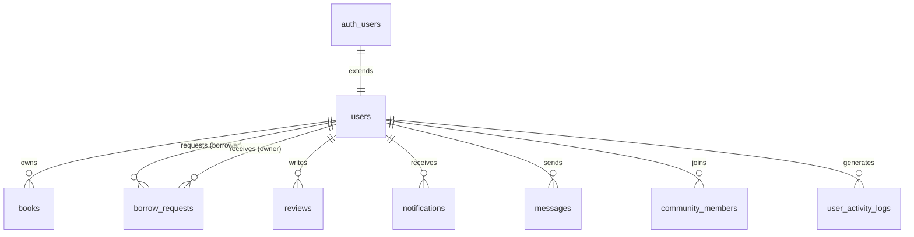

# users

## 1. What This Table Models

The `users` table represents **user profiles** in the BookShare application. It extends Supabase's built-in `auth.users` table with application-specific profile information.

**Entity Type**: Core Entity

This table exists because:
- Supabase Auth handles authentication (email/password, sessions, JWTs)
- Application needs additional profile data (name, bio, avatar, admin status)
- Separation allows querying profiles without touching auth system

The `users` table acts as a **1:1 extension** of `auth.users`, not a replacement.

---

## 2. Column-by-Column Deep Dive

### `id` (UUID, PRIMARY KEY)
- **Meaning**: Unique identifier for the user, synchronized with `auth.users.id`
- **Type Rationale**: UUID matches Supabase Auth's ID format
- **Nullable**: NOT NULL (required)
- **Default**: None - must match auth.users.id exactly
- **Hidden Assumptions**: Assumes user is created in auth.users first
- **Potential Issues**: If auth user is deleted, CASCADE ensures profile is deleted too

### `email` (TEXT, NOT NULL, UNIQUE)
- **Meaning**: User's email address (duplicated from auth.users)
- **Type Rationale**: TEXT allows any length email
- **Nullable**: NOT NULL (required for identification)
- **Default**: None
- **Hidden Assumptions**: Email is validated at auth signup
- **Potential Issues**: **Duplication with auth.users.email** - could become stale if email changes in auth but not synced

### `name` (TEXT, NOT NULL)
- **Meaning**: User's display name
- **Type Rationale**: TEXT for flexibility (no length limit)
- **Nullable**: NOT NULL (required for display)
- **Default**: None
- **Hidden Assumptions**: Name is set during signup
- **Potential Issues**: No length validation - could store excessively long names

### `avatar_url` (TEXT, NULL)
- **Meaning**: URL to user's profile picture
- **Type Rationale**: TEXT for URL storage
- **Nullable**: NULL (optional - users may not upload avatar)
- **Default**: NULL
- **Hidden Assumptions**: URL points to Supabase Storage or external URL
- **Potential Issues**: No URL validation, broken links won't be detected

### `bio` (TEXT, NULL)
- **Meaning**: User's biography/description
- **Type Rationale**: TEXT for long-form content
- **Nullable**: NULL (optional)
- **Default**: NULL
- **Hidden Assumptions**: None
- **Potential Issues**: No length limit - could store very large bios

### `is_admin` (BOOLEAN, DEFAULT FALSE)
- **Meaning**: Whether user has admin privileges
- **Type Rationale**: Simple boolean for binary admin/non-admin
- **Nullable**: NOT NULL (DEFAULT FALSE)
- **Default**: FALSE
- **Hidden Assumptions**: Only one level of admin (no roles hierarchy)
- **Potential Issues**: No audit trail of who granted admin status

### `suspended` (BOOLEAN, DEFAULT FALSE)
- **Meaning**: Whether user account is suspended
- **Type Rationale**: Boolean for active/suspended state
- **Nullable**: NOT NULL (DEFAULT FALSE)
- **Default**: FALSE
- **Hidden Assumptions**: Suspended users cannot perform actions
- **Potential Issues**: **Auth layer doesn't check this** - suspended users can still authenticate

### `suspended_at` (TIMESTAMPTZ, NULL)
- **Meaning**: When the user was suspended
- **Type Rationale**: TIMESTAMPTZ for timezone-aware timestamp
- **Nullable**: NULL (only set when suspended)
- **Default**: NULL
- **Hidden Assumptions**: Set when suspended=TRUE
- **Potential Issues**: Could become stale if suspended is toggled without updating this

### `suspended_reason` (TEXT, NULL)
- **Meaning**: Reason for suspension (admin notes)
- **Type Rationale**: TEXT for flexible reason description
- **Nullable**: NULL (only set when suspended)
- **Default**: NULL
- **Hidden Assumptions**: Set by admin when suspending
- **Potential Issues**: No standardized reason codes

### `created_at` (TIMESTAMPTZ, NOT NULL, DEFAULT NOW())
- **Meaning**: When the profile was created
- **Type Rationale**: TIMESTAMPTZ for timezone-aware timestamp
- **Nullable**: NOT NULL
- **Default**: NOW()
- **Hidden Assumptions**: Set automatically on insert
- **Potential Issues**: None

### `updated_at` (TIMESTAMPTZ, NOT NULL, DEFAULT NOW())
- **Meaning**: When the profile was last updated
- **Type Rationale**: TIMESTAMPTZ for timezone-aware timestamp
- **Nullable**: NOT NULL
- **Default**: NOW() (updated via trigger)
- **Hidden Assumptions**: Trigger keeps this current
- **Potential Issues**: None

---

## 3. Constraints & Indexes

### Primary Key
```sql
PRIMARY KEY (id)
```
- Uses UUID from auth.users
- Ensures each user has exactly one profile

### Foreign Key
```sql
REFERENCES auth.users(id) ON DELETE CASCADE
```
- Links to Supabase Auth user
- **ON DELETE CASCADE**: Profile auto-deleted when auth user deleted
- 👉 [Supabase Auth User Management](https://supabase.com/docs/guides/auth/managing-user-data)

### Unique Constraint
```sql
UNIQUE (email)
```
- Prevents duplicate emails
- Matches auth.users constraint

### Indexes
```sql
CREATE INDEX users_email_idx ON public.users(email);
CREATE INDEX idx_users_is_admin ON public.users(is_admin) WHERE is_admin = TRUE;
CREATE INDEX idx_users_suspended ON users(suspended);
```
- `users_email_idx`: Fast email lookups
- `idx_users_is_admin`: **Partial index** - only indexes admin users (efficient for admin checks)
- `idx_users_suspended`: Fast queries for suspended users

### Triggers
```sql
CREATE TRIGGER update_users_updated_at BEFORE UPDATE ON public.users
  FOR EACH ROW EXECUTE FUNCTION update_updated_at_column();
```
- Automatically updates `updated_at` on every update

**System Invariants Enforced**:
- One profile per auth user
- Unique emails
- Timestamps always current

---

## 4. Relationships to Other Tables



### Relationships

| Related Table | Relationship | FK Column | Notes |
|---------------|--------------|-----------|-------|
| `auth.users` | 1:1 | `id` | Profile extends auth user |
| `books` | 1:many | `owner_id` | User owns many books |
| `borrow_requests` | 1:many | `borrower_id` | User borrows books |
| `borrow_requests` | 1:many | `owner_id` | User receives requests |
| `reviews` | 1:many | `user_id` | User writes reviews |
| `notifications` | 1:many | `user_id` | User receives notifications |
| `messages` | 1:many | `sender_id` | User sends messages |
| `community_members` | 1:many | `user_id` | User joins communities |
| `user_activity_logs` | 1:many | `user_id` | User generates activity |

All foreign keys use **ON DELETE CASCADE** - deleting a user cascades to all related data.

---

## 5. RLS (Row-Level Security) Rules

RLS is **ENABLED** on this table.

### Policies

| Policy | Operation | Rule | Purpose |
|--------|-----------|------|---------|
| "Users can view all profiles" | SELECT | `USING (true)` | Public profiles |
| "Users can update own profile" | UPDATE | `USING (auth.uid() = id)` | Self-edit only |
| "Users can insert own profile" | INSERT | `WITH CHECK (auth.uid() = id)` | Self-create only |
| "Admins can view all users" | SELECT | `EXISTS (SELECT 1 FROM users WHERE id = auth.uid() AND is_admin = TRUE)` | Admin access |

### Edge Cases

1. **No DELETE policy for regular users** - Users cannot delete their own profiles directly
2. **Admin policy uses subquery** - Could cause performance issues at scale
3. **Suspended users can still read profiles** - No suspension check in SELECT policies

👉 [Supabase Row Level Security](https://supabase.com/docs/guides/auth/row-level-security)

---

## 6. How This Table Is Used in the api-client

### Query Locations

```typescript
// users.ts
.from('users').select('*').eq('id', user.id)           // getCurrentUserProfile
.from('users').select('*').eq('id', userId)            // getUserProfile
.from('users').update({...}).eq('id', userId)          // updateProfile

// userSearch.ts
.from('users').select('*').or(`name.ilike.%${searchTerm}%,email.ilike.%${searchTerm}%`)

// admin.ts
.from('users').select('*')                             // getAllUsers
.from('users').update({ is_admin: ... })               // updateUserAdminStatus
.from('users').update({ suspended: true, ... })        // suspendUser
```

### Query Analysis

| Query | Optimal? | Notes |
|-------|----------|-------|
| Get by ID | Yes | Primary key lookup |
| Search by name/email | No | `ilike` causes full scan |
| Get all users (admin) | Needs pagination | Could return huge dataset |
| Update profile | Yes | Simple key-based update |

### RLS Interactions

- **Admin queries** work because of "Admins can view all users" policy
- **Search queries** are public (all profiles viewable)
- **Update queries** restricted to own profile or admin

---

## 7. Alternative Schema Designs

### Alternative A: Embed Admin in auth.users Metadata

```sql
-- Instead of is_admin column, use auth.users.raw_user_meta_data
UPDATE auth.users SET raw_user_meta_data = jsonb_set(
  raw_user_meta_data, '{is_admin}', 'true'
) WHERE id = 'user-id';
```

**Pros**: No separate column, auth-native
**Cons**: Can't query admins efficiently, no RLS on auth.users

### Alternative B: Roles Table

```sql
CREATE TABLE roles (id UUID, name TEXT);
CREATE TABLE user_roles (user_id UUID, role_id UUID);
```

**Pros**: Multiple roles per user, flexible permissions
**Cons**: More complexity, more joins

### Alternative C: Denormalize Avatar into auth.users

Use `raw_user_meta_data` for avatar_url.

**Pros**: Single source of truth
**Cons**: Harder to query, can't use RLS

**Recommendation**: Current design is appropriate for simple admin/non-admin model. Consider roles table if more permission levels needed.

---

## 8. Scalability Considerations

### Query Performance at Scale

| Operation | 10K Users | 100K Users | 1M Users |
|-----------|-----------|------------|----------|
| Get by ID | Fast | Fast | Fast |
| Search (ilike) | Slow | Very Slow | Unusable |
| List all admins | Fast | Fast | Fast (partial index) |

### Recommendations

1. **Add full-text search index** for name/email:
   ```sql
   CREATE INDEX users_search_idx ON users
   USING gin(to_tsvector('english', name || ' ' || email));
   ```

2. **Paginate getAllUsers** - Never return unbounded results

3. **Consider caching** admin status (checked frequently)

### Storage Growth

- ~500 bytes per user (excluding avatar data stored in Storage)
- 1M users ≈ 500MB (manageable)

---

## 9. Suggested Improvements

### Schema Changes

```sql
-- Add length constraint to name
ALTER TABLE users ADD CONSTRAINT name_length CHECK (char_length(name) <= 100);

-- Add email change tracking
ALTER TABLE users ADD COLUMN email_verified BOOLEAN DEFAULT FALSE;

-- Add last login tracking
ALTER TABLE users ADD COLUMN last_login_at TIMESTAMPTZ;
```

### RLS Improvements

```sql
-- Block suspended users from actions
CREATE POLICY "Suspended users cannot update"
  ON public.users FOR UPDATE
  USING (
    auth.uid() = id
    AND NOT EXISTS (
      SELECT 1 FROM users WHERE id = auth.uid() AND suspended = TRUE
    )
  );
```

### Index Improvements

```sql
-- Full-text search index
CREATE INDEX users_search_idx ON users
USING gin(to_tsvector('english', coalesce(name, '') || ' ' || coalesce(email, '')));
```

### Pitfall Warnings

1. **Email sync**: `users.email` can become stale if auth email changes
2. **Suspension not enforced in auth**: Suspended users can still sign in
3. **Admin check in RLS**: Subquery runs on every request (potential bottleneck)

---

## 10. Summary

### Strengths
- Clean 1:1 extension of auth.users
- Partial index for admin queries is efficient
- CASCADE delete keeps data consistent
- Timestamps auto-updated via trigger

### Weaknesses
- Email duplicated from auth.users (sync risk)
- Suspension not enforced at auth layer
- No roles hierarchy (single is_admin flag)
- Search uses slow `ilike` pattern

### Key Development Reminders
- Always check `suspended` before allowing actions
- Profile must be created after auth signup
- Admin status grants broad access via RLS policies
- Use pagination when listing users
